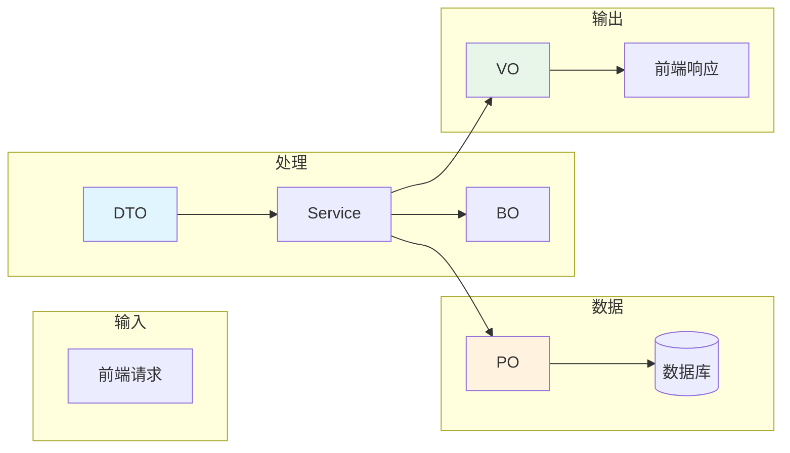
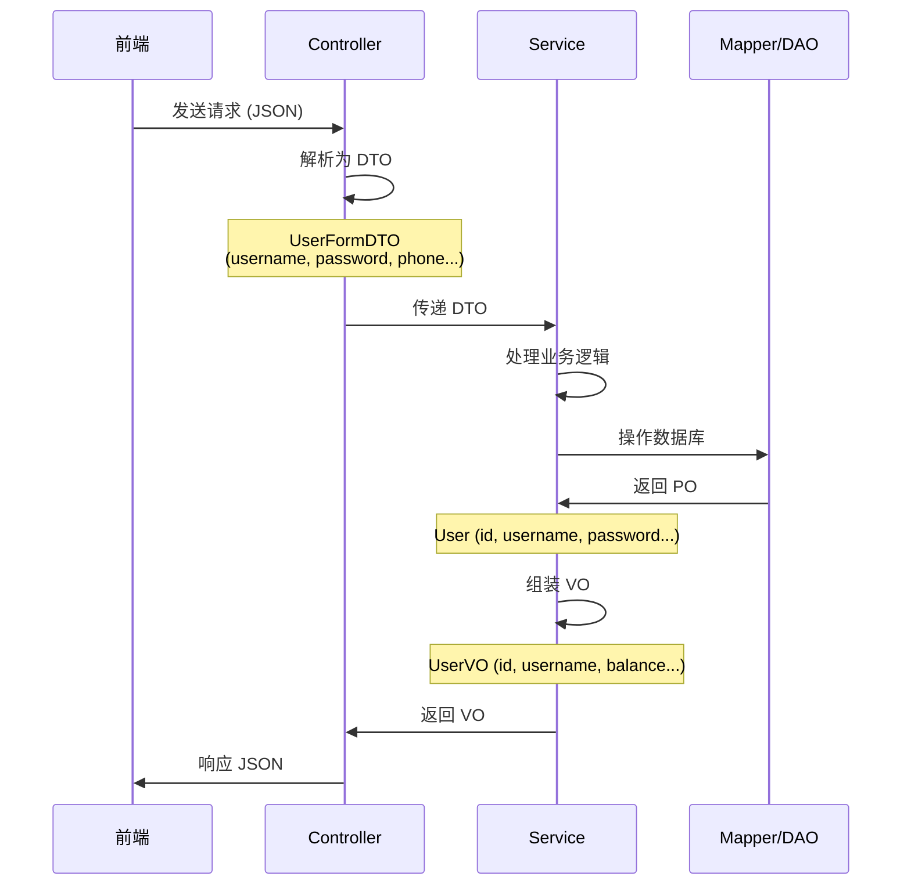

# Java 中的 O 家族

> Java 开发中常见的对象类型：DO、DTO、VO、BO、PO、DAO、POJO

## 概念一览



| 缩写 | 全称 | 中文名 | 用途 |
| :--- | :--- | :--- | :--- |
| **PO** | Persistent Object | 持久化对象 | 数据库表对应的实体类 |
| **DO** | Domain Object | 领域对象 | 业务领域的实体，DDD中使用 |
| **DTO** | Data Transfer Object | 数据传输对象 | 层与层之间传递数据 |
| **VO** | View Object / Value Object | 视图对象/值对象 | 返回给前端的数据 |
| **BO** | Business Object | 业务对象 | 封装复杂业务逻辑 |
| **DAO** | Data Access Object | 数据访问对象 | 数据库操作的封装 |
| **POJO** | Plain Old Java Object | 普通Java对象 | 没有任何约束的普通类 |

---

## 1. PO (Persistent Object) - 持久化对象

数据库表对应的实体类，与数据库一一映射。

```java
@Data
@TableName("user")
public class User {  // 对应 user 表
    @TableId(value = "id", type = IdType.AUTO)
    private Long id;

    private String username;
    private String password;
    private LocalDateTime createTime;
    private LocalDateTime updateTime;
}
```

**特点**：
- 与数据库表一一对应
- 包含所有数据库字段
- 通常由框架管理（MyBatis、Hibernate）

**场景**：MyBatis / Hibernate 映射数据库

---

## 2. DO (Domain Object) - 领域对象

与 PO 概念相似，在 DDD（领域驱动设计）中指业务领域的实体。

```java
// DDD 中的领域对象
public class Order {
    private OrderId id;
    private Money totalAmount;
    private List<OrderItem> items;
    private OrderStatus status;
}
```

**特点**：
- 面向业务领域
- 包含业务逻辑
- 不直接对应数据库表

**场景**：DDD 架构、复杂业务建模

---

## 3. DTO (Data Transfer Object) - 数据传输对象

用于层与层之间传递数据，尤其是 Controller → Service。

```java
@Data
public class UserFormDTO {
    @NotBlank(message = "用户名不能为空")
    private String username;

    @NotBlank(message = "密码不能为空")
    private String password;

    private String phone;
    private String info;
    private Integer balance;
}
```

**特点**：
- 只包含需要传递的字段
- 可以添加校验注解
- 过滤敏感信息

**场景**：
- API 请求参数
- 微服务间调用
- 内部服务间数据传输

**方向**：`Controller → Service`

---

## 4. VO (View Object) - 视图对象

用于返回给前端的数据，只包含展示需要的字段。

```java
@Data
public class UserVO {
    private Long id;
    private String username;
    private String info;
    private Integer status;
    private Integer balance;
    // 不返回 password、phone 等敏感信息
}
```

**特点**：
- 只包含需要展示的字段
- 过滤敏感数据（密码、手机号等）
- 可以格式化显示（如日期格式）

**场景**：API 响应返回给前端

**方向**：`Service → Controller → 前端`

---

## 5. BO (Business Object) - 业务对象

封装业务逻辑的对象，介于 Service 和 PO 之间。

```java
@Data
public class UserBO {
    private User user;
    private List<Role> roles;
    private List<Permission> permissions;

    // 业务方法
    public boolean hasPermission(String permission) {
        return roles.stream()
            .anyMatch(r -> r.getPermissions().contains(permission));
    }
}
```

**特点**：
- 组合多个实体
- 包含业务逻辑
- 不直接对应数据库

**场景**：复杂的业务场景，需要组装多个实体

---

## 6. DAO (Data Access Object) - 数据访问对象

数据库操作的封装，经典三层架构中使用。

```java
public interface UserDao {
    User findById(Long id);

    List<User> findByStatus(Integer status);

    void save(User user);

    void update(User user);

    void deleteById(Long id);
}
```

**特点**：
- 封装数据库 CRUD 操作
- 面向接口编程
- 现在通常用 Mapper 代替

**场景**：数据持久层访问

> **注意**：现在 MyBatis 中更常用 `Mapper` 接口，DAO 概念使用较少。

---

## 7. POJO (Plain Old Java Object)

普通的 Java 对象，没有任何约束，**所有以上都是 POJO**。

```java
// 这就是 POJO
public class User {
    private Long id;
    private String name;
}
```

**特点**：
- 没有任何限制
- 不继承任何类
- 不实现任何接口
- 最基础的 Java 对象

---

## 数据流转图



---

## 在项目中的对应关系

```
新增用户示例：

请求：POST /users
├── UserFormDTO (DTO)
│   ├── username: "zhangsan"
│   ├── password: "123456"
│   ├── phone: "13800138000"
│   ├── info: "{}"
│   └── balance: 1000
│
└── User (PO)
    ├── id: null (自动生成)
    ├── username: "zhangsan"
    ├── password: "123456"
    ├── phone: "13800138000"
    ├── info: "{}"
    ├── balance: 1000
    ├── status: 1 (默认值)
    ├── createTime: now()
    └── updateTime: now()

响应：UserVO (VO)
    ├── id: 1
    ├── username: "zhangsan"
    ├── info: "{}"
    ├── status: 1
    └── balance: 1000
    (不返回 password、phone)
```

---

## 一句话总结

| 对象 | 记忆口诀 |
| :--- | :--- |
| **PO** | **P**ersistence - 存哪儿（数据库） |
| **DO** | **D**omain - 领域模型 |
| **DTO** | **D**ata **T**ransfer - 谁给你（接收参数） |
| **VO** | **V**iew - 给谁看（返回前端） |
| **BO** | **B**usiness - 业务封装 |
| **DAO** | **D**ata **A**ccess - 数据访问 |
| **POJO** | **P**lain **O**ld - 普通对象 |

---

## 最佳实践

1. **请求参数** → DTO（接收前端数据）
2. **响应返回** → VO（返回给前端）
3. **数据库操作** → PO（持久化）
4. **业务复杂时** → BO（组装多个实体）
5. **避免直接用 PO 接收请求** - 会有安全隐患
