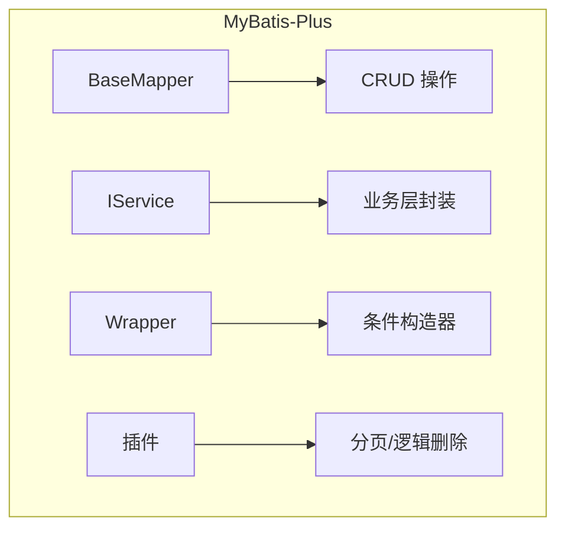
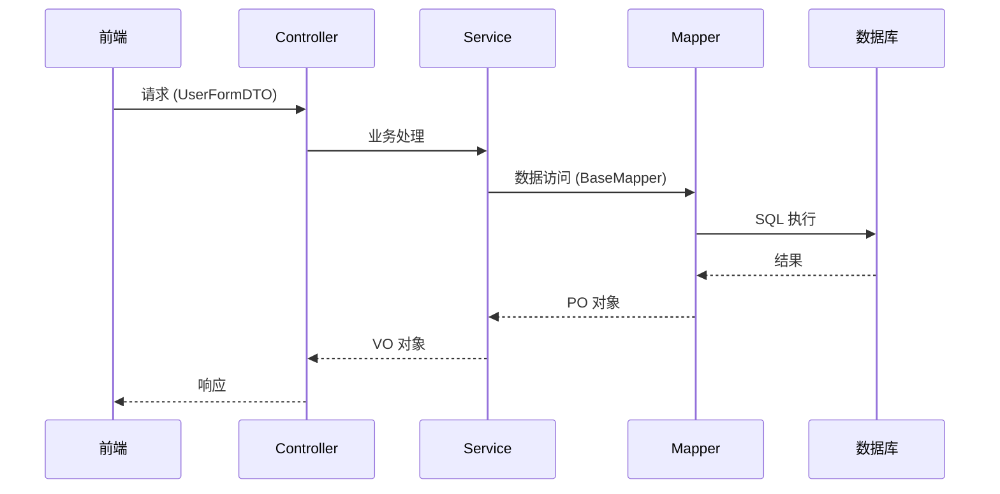

# MyBatis-Plus 企业级开发指南

> MyBatis-Plus 是一个 MyBatis 的增强工具，在 MyBatis 的基础上只做增强不做改变，为简化开发、提高效率而生。
>
> 官网：https://baomidou.com/



## 1. 快速开始

### 1.1 引入依赖

```xml
<!-- Spring Boot 项目 -->
<dependency>
    <groupId>com.baomidou</groupId>
    <artifactId>mybatis-plus-boot-starter</artifactId>
    <version>3.5.7</version>
</dependency>
```

### 1.2 配置 application.yml

```yaml
spring:
  datasource:
    url: jdbc:mysql://localhost:3306/mybatis_plus?useSSL=false&serverTimezone=Asia/Shanghai
    username: root
    password: 123456
    driver-class-name: com.mysql.cj.jdbc.Driver

mybatis-plus:
  configuration:
    # 日志实现
    log-impl: org.apache.ibatis.logging.stdout.StdOutImpl
    # 驼峰命名自动映射
    map-underscore-to-camel-case: true
  # XML 扫描路径
  mapper-locations: classpath*:mapper/**/*.xml
  # 类型别名包
  type-aliases-package: com.example.domain.po
  global-config:
    db-config:
      # 主键策略
      id-type: auto
      # 逻辑删除配置
      logic-delete-field: deleted
      logic-delete-value: 1
      logic-not-delete-value: 0
```

### 1.3 启动类扫描 Mapper

```java
@MapperScan("com.example.mapper")
@SpringBootApplication
public class Application {
    public static void main(String[] args) {
        SpringApplication.run(Application.class, args);
    }
}
```

---

## 2. 核心组件

### 2.1 项目结构规范

```
├── domain/
│   ├── po/          # 持久化对象（数据库实体）
│   │   └── User.java
│   ├── dto/         # 数据传输对象（请求参数）
│   │   └── UserFormDTO.java
│   └── vo/          # 视图对象（响应返回）
│       └── UserVO.java
├── mapper/          # Mapper 接口
│   └── UserMapper.java
├── service/        # 业务接口
│   ├── IUserService.java
│   └── impl/       # 业务实现
│       └── UserServiceImpl.java
└── controller/     # 控制器
    └── UserController.java
```

### 2.2 数据流转



---

## 3. 实体类与注解

### 3.1 常用注解

| 注解 | 说明 |
|------|------|
| `@TableName` | 指定表名 |
| `@TableId` | 主键映射 |
| `@TableField` | 普通字段映射 |
| `@TableLogic` | 逻辑删除 |

### 3.2 完整示例

```java
@Data
@TableName("user")
public class User {

    /**
     * 主键 - 自增
     */
    @TableId(type = IdType.AUTO)
    private Long id;

    /**
     * 用户名 - 指定列名
     */
    @TableField("user_name")
    private String username;

    /**
     * 密码 - 不查询返回
     */
    @TableField(select = false)
    private String password;

    /**
     * 邮箱 - 可为空
     */
    @TableField("email")
    private String email;

    /**
     * 年龄
     */
    @TableField("age")
    private Integer age;

    /**
     * 状态：0-正常 1-禁用
     */
    @TableField("status")
    private Integer status;

    /**
     * 逻辑删除：0-未删除 1-已删除
     */
    @TableLogic
    @TableField("deleted")
    private Integer deleted;

    /**
     * 创建时间 - 插入时自动填充
     */
    @TableField(fill = FieldFill.INSERT)
    private LocalDateTime createTime;

    /**
     * 更新时间 - 插入和更新时自动填充
     */
    @TableField(fill = FieldFill.INSERT_UPDATE)
    private LocalDateTime updateTime;
}
```

### 3.3 主键策略

```java
// 常用主键策略
@TableId(type = IdType.AUTO)          // 数据库自增
@TableId(type = IdType.ASSIGN_ID)     // 雪花算法（默认）
@TableId(type = IdType.ASSIGN_UUID)   // UUID
@TableId(type = IdType.INPUT)         // 用户输入
```

---

## 4. BaseMapper 基础 CRUD

### 4.1 Mapper 接口定义

```java
public interface UserMapper extends BaseMapper<User> {
    // 继承后自动拥有以下方法
}
```

### 4.2 内置 CRUD 方法

```java
// 插入
int insert(T entity);

// 根据 ID 删除
int deleteById(Serializable id);

// 根据 ID 批量删除
int deleteBatchIds(@Param("collection") Collection<? extends Serializable> idList);

// 根据条件删除
int deleteByMap(@Param("cm") Map<String, Object> columnMap);

// 根据条件删除（Wrapper）
int delete(@Param("ew") Wrapper<T> wrapper);

// 根据 ID 更新
int updateById(T entity);

// 根据条件更新
int update(@Param("et") T entity, @Param("ew") Wrapper<T> wrapper);

// 根据 ID 查询
T selectById(Serializable id);

// 根据 ID 批量查询
List<T> selectBatchIds(@Param("collection") Collection<? extends Serializable> idList);

// 根据条件查询单条
T selectOne(@Param("ew") Wrapper<T> wrapper);

// 根据条件查询列表
List<T> selectList(@Param("ew") Wrapper<T> wrapper);

// 根据条件查询数量
Integer selectCount(@Param("ew") Wrapper<T> wrapper);

// 分页查询
IPage<T> selectPage(IPage<T> page, @Param("ew") Wrapper<T> wrapper);
```

---

## 5. IService 业务层封装

### 5.1 Service 接口

```java
public interface UserService extends IService<User> {
    // 继承后自动拥有以下方法
}
```

### 5.2 Service 实现

```java
@Service
public class UserServiceImpl extends ServiceImpl<UserMapper, User> implements UserService {
    // 继承后自动拥有以下 CRUD 方法
}
```

### 5.3 IService 内置方法

```java
// 插入
boolean save(T entity);

// 批量插入
boolean saveBatch(Collection<T> entityList);

// 根据 ID 删除
boolean removeById(Serializable id);

// 根据条件删除
boolean remove(@Param("ew") Wrapper<T> wrapper);

// 根据 ID 更新
boolean updateById(T entity);

// 根据条件更新
boolean update(@Param("et") T entity, @Param("ew") Wrapper<T> wrapper);

// 根据 ID 查询
T getById(Serializable id);

// 根据条件查询
T getOne(@Param("ew") Wrapper<T> wrapper);

// 列表查询
List<T> list();

// 列表查询（条件）
List<T> list(@Param("ew") Wrapper<T> wrapper);

// 数量查询
int count();

// 数量查询（条件）
int count(@Param("ew") Wrapper<T> wrapper);

// 分页查询
IPage<T> page(IPage<T> page);

// 分页查询（条件）
IPage<T> page(IPage<T> page, @Param("ew") Wrapper<T> wrapper);
```

---

## 6. 条件构造器

### 6.1 QueryWrapper 用法

```java
// 查询条件
QueryWrapper<User> wrapper = new QueryWrapper<>();
wrapper.eq("status", 1);              // 等于
wrapper.ne("status", 1);              // 不等于
wrapper.gt("age", 18);                // 大于
wrapper.ge("age", 18);                // 大于等于
wrapper.lt("age", 30);                // 小于
wrapper.le("age", 30);                // 小于等于
wrapper.like("username", "zhang");    // 模糊匹配
wrapper.notLike("username", "zhang"); // 不匹配
wrapper.in("status", 1, 2, 3);        // IN 查询
wrapper.notIn("status", 1, 2, 3);    // NOT IN
wrapper.isNull("email");              // NULL
wrapper.isNotNull("email");           // NOT NULL
wrapper.between("age", 18, 30);      // 范围
wrapper.notBetween("age", 18, 30);    // 范围外
wrapper.orderByAsc("age");            // 升序
wrapper.orderByDesc("age");           // 降序
wrapper.last("LIMIT 1");              // 拼接 SQL 末尾
```

### 6.2 LambdaQueryWrapper（推荐）

```java
// 优点：编译期检查字段名，避免字符串硬编码
LambdaQueryWrapper<User> wrapper = new LambdaQueryWrapper<>();
wrapper.eq(User::getStatus, 1)
       .like(User::getUsername, "zhang")
       .between(User::getAge, 18, 30)
       .orderByDesc(User::getCreateTime);
List<User> list = userMapper.selectList(wrapper);
```

### 6.3 UpdateWrapper 用法

```java
// 直接设置更新值，无需传入实体
UpdateWrapper<User> wrapper = new UpdateWrapper<>();
wrapper.set("status", 0)
       .set("update_time", LocalDateTime.now())
       .eq("id", 1)
       .eq("status", 1);
userMapper.update(null, wrapper);
```

### 6.4 LambdaUpdateWrapper（推荐）

```java
LambdaUpdateWrapper<User> wrapper = new LambdaUpdateWrapper<>();
wrapper.set(User::getStatus, 0)
       .set(User::getBalance, 1000)
       .eq(User::getId, 1)
       .eq(User::getStatus, 1);
userMapper.update(null, wrapper);
```

---

## 7. 分页查询

### 7.1 配置分页插件

```java
@Configuration
public class MyBatisPlusConfig {

    @Bean
    public MybatisPlusInterceptor mybatisPlusInterceptor() {
        MybatisPlusInterceptor interceptor = new MybatisPlusInterceptor();
        // 分页插件
        interceptor.addInnerInterceptor(new PaginationInnerInterceptor(DbType.MYSQL));
        return interceptor;
    }
}
```

### 7.2 分页查询示例

```java
// 第一页，每页 10 条
Page<User> page = new Page<>(1, 10);

LambdaQueryWrapper<User> wrapper = new LambdaQueryWrapper<>();
wrapper.eq(User::getStatus, 1)
       .orderByDesc(User::getCreateTime);

IPage<User> result = userMapper.selectPage(page, wrapper);

// 获取结果
List<User> records = result.getRecords();    // 数据列表
long total = result.getTotal();              // 总数
long pages = result.getPages();              // 总页数
long current = result.getCurrent();          // 当前页
long size = result.getSize();                // 每页数量
```

---

## 8. 自定义 SQL（企业规范）

### 8.1 规范原则

```
Service 层：处理业务逻辑（校验、计算、事务）
Mapper 层：只负责参数绑定和 SQL 执行
```

### 8.2 Mapper 定义具体参数方法

```java
public interface UserMapper extends BaseMapper<User> {

    /**
     * 扣减余额（具体参数，安全防注入）
     */
    int deductBalance(@Param("id") Long id, @Param("amount") Integer amount);

    /**
     * 条件查询用户（具体参数）
     */
    List<User> selectByCondition(@Param("status") Integer status,
                                  @Param("username") String username);
}
```

### 8.3 XML 实现（使用 #{} 绑定）

```xml
<?xml version="1.0" encoding="UTF-8"?>
<!DOCTYPE mapper PUBLIC "-//mybatis.org//DTD Mapper 3.0//EN" "http://mybatis.org/dtd/mybatis-3-mapper.dtd">
<mapper namespace="com.example.mapper.UserMapper">

    <!-- 扣减余额 -->
    <update id="deductBalance">
        UPDATE user
        SET balance = balance - #{amount},
            update_time = NOW()
        WHERE id = #{id}
    </update>

    <!-- 条件查询 -->
    <select id="selectByCondition" resultType="User">
        SELECT * FROM user
        WHERE deleted = 0
        <if test="status != null">
            AND status = #{status}
        </if>
        <if test="username != null and username != ''">
            AND username LIKE CONCAT('%', #{username}, '%')
        </if>
        ORDER BY create_time DESC
    </select>

</mapper>
```

### 8.4 Service 调用

```java
@Service
public class UserServiceImpl extends ServiceImpl<UserMapper, User> implements UserService {

    @Override
    @Transactional(rollbackFor = Exception.class)
    public void deductionBalance(Long id, Integer money) {
        // 1. 业务校验
        User user = getById(id);
        if (user == null || user.getStatus() != 1) {
            throw new BusinessException("用户不存在或状态异常");
        }
        if (user.getBalance() < money) {
            throw new BusinessException("余额不足");
        }

        // 2. 调用 Mapper
        baseMapper.deductBalance(id, money);
    }
}
```

---

## 9. 逻辑删除

### 9.1 全局配置

```yaml
mybatis-plus:
  global-config:
    db-config:
      logic-delete-field: deleted      # 全局逻辑删除字段
      logic-delete-value: 1            # 删除值
      logic-not-delete-value: 0        # 未删除值
```

### 9.2 实体类配置

```java
@TableLogic
@TableField("deleted")
private Integer deleted;
```

### 9.3 说明

配置逻辑删除后，所有 CRUD 操作会自动处理：
- **删除**：变成 UPDATE（设置 deleted = 1）
- **查询**：自动 WHERE deleted = 0
- **更新**：不受影响

---

## 10. 自动填充

### 10.1 配置填充器

```java
@Component
public class MyMetaObjectHandler implements MetaObjectHandler {

    @Override
    public void insertFill(MetaObject metaObject) {
        // 插入时填充
        this.strictInsertFill(metaObject, "createTime", LocalDateTime.class, LocalDateTime.now());
        this.strictInsertFill(metaObject, "updateTime", LocalDateTime.class, LocalDateTime.now());
    }

    @Override
    public void updateFill(MetaObject metaObject) {
        // 更新时填充
        this.strictUpdateFill(metaObject, "updateTime", LocalDateTime.class, LocalDateTime.now());
    }
}
```

### 10.2 实体类配置

```java
@TableField(fill = FieldFill.INSERT)
private LocalDateTime createTime;

@TableField(fill = FieldFill.INSERT_UPDATE)
private LocalDateTime updateTime;
```

---

## 11. 常用场景

### 11.1 简单 CRUD 用内置方法

```java
// 新增
userService.save(user);

// 根据 ID 查询
User user = userService.getById(id);

// 列表查询
List<User> list = userService.list();

// 分页查询
Page<User> page = new Page<>(1, 10);
IPage<User> result = userService.page(page);
```

### 11.2 复杂业务手写 Mapper

```java
// 1. 业务校验（Service）
if (user.getBalance() < money) {
    throw new BusinessException("余额不足");
}

// 2. 调用 Mapper
baseMapper.deductBalance(id, money);
```

---

## 12. 常见问题

### 12.1 SQL 注入问题

| ❌ 错误做法 | ✅ 正确做法 |
|------------|------------|
| `${ew.customSqlSegment}` | 具体参数 + `#{}` |
| `${tableName}` 动态表名 | 使用 `@TableName` 注解 |

### 12.2 性能问题

| ❌ 错误做法 | ✅ 正确做法 |
|------------|------------|
| `list()` 查全量 | 分页查询 |
| 循环单条插入 | 批量插入 `saveBatch()` |
| `select *` | 指定查询字段 |

### 12.3 Wrapper 使用问题

| ❌ 错误做法 | ✅ 正确做法 |
|------------|------------|
| `QueryWrapper` 字符串写法 | `LambdaQueryWrapper` 防止列名写错 |
| 不用事务 | `@Transactional` 保证数据一致 |

---

## 13. 一句话总结

```
MyBatis-Plus 使用原则：
━━━━━━━━━━━━━━━━━━━━━━━━━━━━━━━━━━━━━━━━━
✅ 简单 CRUD → 用 Service/BaseMapper 内置方法
✅ 复杂查询 → 用 LambdaQueryWrapper
✅ 手写 SQL → Mapper 接收具体参数，使用 #{}
✅ 分页查询 → 配置分页插件
✅ 逻辑删除 → 全局配置 + @TableLogic
✅ 事务管理 → @Transactional
━━━━━━━━━━━━━━━━━━━━━━━━━━━━━━━━━━━━━━━━━
```

---

## 参考资料

- [MyBatis-Plus 官网](https://baomidou.com/)
- [MyBatis-Plus Github](https://github.com/baomidou/mybatis-plus)
- [MyBatis-Plus 官方文档](https://baomidou.com/guide/)
