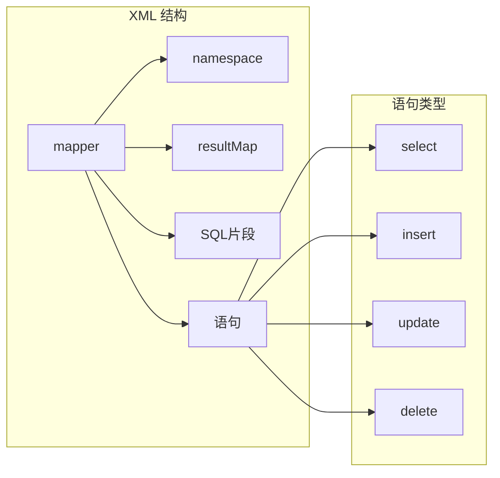

# MyBatis Mapper XML 企业级开发指南

> MyBatis XML 映射文件的完整指南，包含企业开发规范和最佳实践



---

## 1. XML 文件结构

### 1.1 基础结构

```xml
<?xml version="1.0" encoding="UTF-8"?>
<!DOCTYPE mapper PUBLIC "-//mybatis.org//DTD Mapper 3.0//EN" "http://mybatis.org/dtd/mybatis-3-mapper.dtd">

<!-- namespace: 必须与 Mapper 接口全限定名一致 -->
<mapper namespace="com.example.mapper.UserMapper">

    <!-- 结果映射 -->
    <resultMap id="BaseResultMap" type="com.example.domain.po.User">
        <id column="id" property="id"/>
        <result column="user_name" property="username"/>
        <result column="create_time" property="createTime"/>
    </resultMap>

    <!-- 通用列 -->
    <sql id="Base_Column_List">
        id, username, password, phone, status, balance, create_time, update_time
    </sql>

    <!-- 查询 -->
    <select id="selectById" resultMap="BaseResultMap">
        SELECT <include refid="Base_Column_List"/>
        FROM user
        WHERE id = #{id}
    </select>

</mapper>
```

### 1.2 namespace 规范

```xml
<!-- ✅ 正确：与 Mapper 接口路径一致 -->
<mapper namespace="com.example.mapper.UserMapper">

<!-- ❌ 错误：路径不匹配 -->
<mapper namespace="com.example.dao.UserDao">
```

---

## 2. 增删改查

### 2.1 查询（select）

```xml
<!-- 根据 ID 查询 -->
<select id="selectById" resultType="User">
    SELECT * FROM user WHERE id = #{id}
</select>

<!-- 条件查询 -->
<select id="selectByCondition" resultType="User">
    SELECT * FROM user
    WHERE status = 1
    <if test="username != null and username != ''">
        AND username LIKE CONCAT('%', #{username}, '%')
    </if>
    <if test="age != null">
        AND age = #{age}
    </if>
    ORDER BY create_time DESC
</select>

<!-- 结果映射 -->
<select id="selectById" resultMap="BaseResultMap">
    SELECT id, user_name, phone, status, balance
    FROM user
    WHERE id = #{id}
</select>
```

### 2.2 插入（insert）

```xml
<!-- 插入单条 -->
<insert id="insert" useGeneratedKeys="true" keyProperty="id">
    INSERT INTO user (username, password, phone, balance, create_time)
    VALUES (#{username}, #{password}, #{phone}, #{balance}, NOW())
</insert>

<!-- 插入并返回主键 -->
<insert id="insert" useGeneratedKeys="true" keyProperty="id" keyColumn="id">
    INSERT INTO user (username, password, phone, balance)
    VALUES (#{username}, #{password}, #{phone}, #{balance})
</insert>

<!-- 批量插入 -->
<insert id="insertBatch">
    INSERT INTO user (username, password, phone, balance) VALUES
    <foreach collection="list" item="item" separator=",">
        (#{item.username}, #{item.password}, #{item.phone}, #{item.balance})
    </foreach>
</insert>
```

### 2.3 更新（update）

```xml
<!-- 根据 ID 更新 -->
<update id="updateById">
    UPDATE user
    SET username = #{username},
        phone = #{phone},
        update_time = NOW()
    WHERE id = #{id}
</update>

<!-- 动态更新 -->
<update id="updateByCondition">
    UPDATE user
    <set>
        <if test="username != null">username = #{username},</if>
        <if test="phone != null">phone = #{phone},</if>
        update_time = NOW(),
    </set>
    WHERE id = #{id}
</update>

<!-- 扣减余额（防注入） -->
<update id="deductBalance">
    UPDATE user
    SET balance = balance - #{amount},
        update_time = NOW()
    WHERE id = #{id}
    AND balance >= #{amount}
</update>
```

### 2.4 删除（delete）

```xml
<!-- 根据 ID 删除 -->
<delete id="deleteById">
    DELETE FROM user WHERE id = #{id}
</delete>

<!-- 批量删除 -->
<delete id="deleteBatchIds">
    DELETE FROM user WHERE id IN
    <foreach collection="list" item="id" open="(" separator="," close=")">
        #{id}
    </foreach>
</delete>

<!-- 条件删除 -->
<delete id="deleteByCondition">
    DELETE FROM user
    WHERE status = #{status}
    <if test="createTime != null">
        AND create_time &lt; #{createTime}
    </if>
</delete>
```

---

## 3. 动态 SQL

### 3.1 if 条件判断

```xml
<select id="selectByCondition" resultType="User">
    SELECT * FROM user
    WHERE 1=1
    <if test="status != null">
        AND status = #{status}
    </if>
    <if test="username != null and username != ''">
        AND username LIKE CONCAT('%', #{username}, '%')
    </if>
    <if test="minAge != null">
        AND age &gt;= #{minAge}
    </if>
    <if test="maxAge != null">
        AND age &lt;= #{maxAge}
    </if>
</select>
```

### 3.2 choose (when, otherwise)

```xml
<select id="selectByStatus" resultType="User">
    SELECT * FROM user
    <where>
        <choose>
            <when test="status == 1">
                AND status = 1
            </when>
            <when test="status == 0">
                AND status = 0
            </when>
            <otherwise>
                AND status IN (0, 1)
            </otherwise>
        </choose>
    </where>
</select>
```

### 3.3 where 标签

```xml
<!-- 自动处理 AND/OR -->
<select id="selectByCondition" resultType="User">
    SELECT * FROM user
    <where>
        <if test="status != null">
            AND status = #{status}
        </if>
        <if test="username != null">
            AND username = #{username}
        </if>
    </where>
</select>
```

### 3.4 set 标签

```xml
<!-- 自动处理逗号 -->
<update id="updateById">
    UPDATE user
    <set>
        <if test="username != null">username = #{username},</if>
        <if test="phone != null">phone = #{phone},</if>
        update_time = NOW(),
    </set>
    WHERE id = #{id}
</update>
```

### 3.5 foreach 循环

```xml
<!-- IN 查询 -->
<select id="selectByIds" resultType="User">
    SELECT * FROM user
    WHERE id IN
    <foreach collection="list" item="id" open="(" separator="," close=")">
        #{id}
    </foreach>
</select>

<!-- 批量插入 -->
<insert id="insertBatch">
    INSERT INTO user (username, password, phone) VALUES
    <foreach collection="list" item="user" separator=",">
        (#{user.username}, #{user.password}, #{user.phone})
    </foreach>
</insert>

<!-- 批量更新 -->
<update id="updateBatch">
    <foreach collection="list" item="user" separator=";">
        UPDATE user
        SET username = #{user.username}
        WHERE id = #{user.id}
    </foreach>
</update>

<!-- 批量删除 -->
<delete id="deleteBatch">
    DELETE FROM user WHERE id IN
    <foreach collection="list" item="id" collection="list" open="(" separator="," close=")">
        #{id}
    </foreach>
</delete>
```

### 3.6 trim 标签

```xml
<!-- 自定义前缀/后缀 -->
<select id="selectByCondition" resultType="User">
    SELECT * FROM user
    <trim prefix="WHERE" prefixOverrides="AND|OR">
        <if test="status != null">
            AND status = #{status}
        </if>
    </trim>
</select>

<!-- 自定义 SET -->
<update id="updateById">
    UPDATE user
    <trim prefix="SET" suffixOverrides=",">
        <if test="username != null">username = #{username},</if>
        <if test="phone != null">phone = #{phone},</if>
    </trim>
    WHERE id = #{id}
</update>
```

---

## 4. 结果映射

### 4.1 resultMap 基础

```xml
<resultMap id="BaseResultMap" type="User">
    <!-- 主键 -->
    <id column="id" property="id"/>

    <!-- 普通字段 -->
    <result column="user_name" property="username"/>
    <result column="phone" property="phone"/>
    <result column="balance" property="balance"/>
    <result column="create_time" property="createTime"/>
</resultMap>
```

### 4.2 驼峰映射

```yaml
# application.yml 配置
mybatis-plus:
  configuration:
    map-underscore-to-camel-case: true
```

配置后，以下划线命名的列会自动映射到驼峰属性：
- `user_name` → `userName`
- `create_time` → `createTime`

### 4.3 关联查询（一对多）

```xml
<!-- 用户订单 resultMap -->
<resultMap id="UserOrderMap" type="com.example.domain.vo.UserOrderVO">
    <id column="id" property="id"/>
    <result column="username" property="username"/>
    <!-- 一对多：collection -->
    <collection property="orders" ofType="Order">
        <id column="order_id" property="orderId"/>
        <result column="order_no" property="orderNo"/>
        <result column="amount" property="amount"/>
    </collection>
</resultMap>

<select id="selectUserWithOrders" resultMap="UserOrderMap">
    SELECT u.id, u.username, o.id as order_id, o.order_no, o.amount
    FROM user u
    LEFT JOIN `order` o ON u.id = o.user_id
    WHERE u.id = #{id}
</select>
```

### 4.4 关联查询（多对一）

```xml
<!-- 订单用户 resultMap -->
<resultMap id="OrderUserMap" type="Order">
    <id column="id" property="id"/>
    <result column="order_no" property="orderNo"/>
    <result column="amount" property="amount"/>
    <!-- 多对一：association -->
    <association property="user" javaType="User">
        <id column="user_id" property="id"/>
        <result column="username" property="username"/>
    </association>
</resultMap>

<select id="selectOrderWithUser" resultMap="OrderUserMap">
    SELECT o.id, o.order_no, o.amount, u.id as user_id, u.username
    FROM `order` o
    LEFT JOIN user u ON o.user_id = u.id
    WHERE o.id = #{id}
</select>
```

---

## 5. SQL 片段

### 5.1 通用列片段

```xml
<!-- 定义 -->
<sql id="Base_Column_List">
    id, username, phone, status, balance, create_time, update_time
</sql>

<!-- 使用 -->
<select id="selectById" resultType="User">
    SELECT <include refid="Base_Column_List"/>
    FROM user
    WHERE id = #{id}
</select>
```

### 5.2 通用条件片段

```xml
<sql id="Where_Status">
    <where>
        <if test="status != null">
            AND status = #{status}
        </if>
        <if test="deleted = 0">
            AND deleted = 0
        </if>
    </where>
</sql>

<select id="selectByCondition" resultType="User">
    SELECT * FROM user
    <include refid="Where_Status"/>
</select>
```

---

## 6. 企业级最佳实践

### 6.1 安全规范

```xml
<!-- ✅ 使用 #{} 参数绑定，防止 SQL 注入 -->
<select id="selectById" resultType="User">
    SELECT * FROM user WHERE id = #{id}
</select>

<!-- ❌ 禁止使用 ${} 字符串拼接 -->
<select id="selectById" resultType="User">
    SELECT * FROM user WHERE id = ${id}
</select>

<!-- ⚠️ 特殊场景必须使用 ${} 时（如动态表名），需手动校验 -->
<select id="selectByTable" resultType="User">
    SELECT * FROM ${tableName} WHERE id = #{id}
</select>
```

### 6.2 参数规范

```java
// ✅ 推荐：Mapper 接收具体参数
public interface UserMapper {
    int deductBalance(@Param("id") Long id, @Param("amount") Integer amount);
}

// ❌ 不推荐：传递整个对象
public interface UserMapper {
    int deductBalance(User user);
}
```

```xml
<!-- ✅ 推荐：接收具体参数 -->
<update id="deductBalance">
    UPDATE user SET balance = balance - #{amount} WHERE id = #{id}
</update>

<!-- ❌ 不推荐：传递对象 -->
<update id="deductBalance">
    UPDATE user SET balance = balance - #{user.balance} WHERE id = #{user.id}
</update>
```

### 6.3 返回值规范

```xml
<!-- 返回单条 -->
<select id="selectById" resultType="User">
    SELECT * FROM user WHERE id = #{id}
</select>

<!-- 返回列表 -->
<select id="selectList" resultType="User">
    SELECT * FROM user WHERE status = 1
</select>

<!-- 返回 Map -->
<select id="selectById" resultType="map">
    SELECT username, phone FROM user WHERE id = #{id}
</select>

<!-- 返回分页（MyBatis-Plus） -->
<select id="selectPage" resultType="User">
    SELECT * FROM user WHERE status = 1
</select>
```

### 6.4 命名规范

```xml
<!-- ✅ 方法命名：操作 + By + 条件 -->
<select id="selectById" ...>
<select id="selectByUsername" ...>
<select id="selectByCondition" ...>
<insert id="insert" ...>
<update id="updateById" ...>
<delete id="deleteById" ...>

<!-- ❌ 避免：无意义命名 -->
<select id="get" ...>
<select id="find" ...>
```

---

## 7. 常见场景

### 7.1 分页查询

```xml
<select id="selectPage" resultType="User">
    SELECT * FROM user
    <where>
        <if test="status != null">
            AND status = #{status}
        </if>
    </where>
    ORDER BY create_time DESC
    LIMIT #{offset}, #{pageSize}
</select>
```

### 7.2 模糊查询

```xml
<!-- 方式一：CONCAT（推荐） -->
<select id="selectByUsername" resultType="User">
    SELECT * FROM user
    WHERE username LIKE CONCAT('%', #{username}, '%')
</select>

<!-- 方式二：bind 标签 -->
<select id="selectByUsername" resultType="User">
    <bind name="pattern" value="'%' + username + '%'"/>
    SELECT * FROM user
    WHERE username LIKE #{pattern}
</select>
```

### 7.3 批量操作

```xml
<!-- 批量插入 -->
<insert id="insertBatch" parameterType="list">
    INSERT INTO user (username, phone, balance) VALUES
    <foreach collection="list" item="item" separator=",">
        (#{item.username}, #{item.phone}, #{item.balance})
    </foreach>
</insert>

<!-- 批量更新（方式一：SET） -->
<update id="updateBatch">
    <foreach collection="list" item="item" separator=";">
        UPDATE user SET balance = #{item.balance} WHERE id = #{item.id}
    </foreach>
</update>

<!-- 批量更新（方式二：CASE WHEN） -->
<update id="updateBatch">
    UPDATE user
    <trim prefix="SET" suffixOverrides=",">
        balance = CASE id
        <foreach collection="list" item="item">
            WHEN #{item.id} THEN #{item.balance}
        </foreach>
        END
    </trim>
    WHERE id IN
    <foreach collection="list" item="item" open="(" separator="," close=")">
        #{item.id}
    </foreach>
</update>
```

### 7.4 复杂条件查询

```xml
<select id="selectComplex" resultType="User">
    SELECT * FROM user
    <where>
        <!-- 状态筛选 -->
        <if test="status != null">
            AND status = #{status}
        </if>

        <!-- 关键词搜索 -->
        <if test="keyword != null and keyword != ''">
            AND (username LIKE CONCAT('%', #{keyword}, '%')
                 OR phone LIKE CONCAT('%', #{keyword}, '%'))
        </if>

        <!-- 金额范围 -->
        <if test="minBalance != null">
            AND balance &gt;= #{minBalance}
        </if>
        <if test="maxBalance != null">
            AND balance &lt;= #{maxBalance}
        </if>

        <!-- 时间范围 -->
        <if test="startTime != null">
            AND create_time &gt;= #{startTime}
        </if>
        <if test="endTime != null">
            AND create_time &lt;= #{endTime}
        </if>

        <!-- ID 列表 -->
        <if test="ids != null and ids.size() > 0">
            AND id IN
            <foreach collection="ids" item="id" open="(" separator="," close=")">
                #{id}
            </foreach>
        </if>
    </where>
    ORDER BY create_time DESC
</select>
```

---

## 8. 一句话总结

```
MyBatis XML 最佳实践：
━━━━━━━━━━━━━━━━━━━━━━━━━━━━━━━━━━━━━━━━━
✅ 参数绑定 → 使用 #{}，禁止 ${}
✅ 方法命名 → 操作 + By + 条件
✅ 动态 SQL → if / where / set / foreach
✅ 复杂查询 → SQL 片段复用
✅ 返回值 → 明确指定 resultType/resultMap
✅ 批量操作 → foreach 循环
━━━━━━━━━━━━━━━━━━━━━━━━━━━━━━━━━━━━━━━━━
```

---

## 参考资料

- [MyBatis 官方文档](https://mybatis.org/mybatis-3/)
- [MyBatis-Plus 官方文档](https://baomidou.com/guide/)
