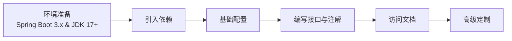

# Knife4j OpenAPI3 Jakarta Spring Boot Starter 使用教程 (v4.4.0)
本教程专为 `knife4j-openapi3-jakarta-spring-boot-starter` 4.4.0 版本编写，适用于 **Spring Boot 3.x** 和 **JDK 17+** 环境。Knife4j 是一个基于 Swagger/OpenAPI 的增强工具，提供了更美观、功能更强大的 API 文档界面。

## 1. 环境要求与依赖引入
### 1.1 环境要求
在使用本教程之前，请确保您的项目满足以下条件：
- **Spring Boot**: 3.0.0 或以上版本
- **JDK**: JDK 17 或以上版本
- **Servlet规范**: Jakarta EE（而非 Java EE）
> ⚠️ **注意**：`jakarta` 版本的 starter 仅适用于 Spring Boot 3.x。如果您使用的是 Spring Boot 2.x，请更换为 `knife4j-openapi3-spring-boot-starter`（非 jakarta 版本）。
### 1.2 引入依赖
在您的 `pom.xml` 文件中添加以下依赖：
```xml
<dependency>
    <groupId>com.github.xiaoymin</groupId>
    <artifactId>knife4j-openapi3-jakarta-spring-boot-starter</artifactId>
    <version>4.4.0</version>
</dependency>
```
## 2. 基础配置
### 2.1 application.yml 配置
在 `application.yml` 中进行基础配置，这是最常用的配置方式：
```yaml
# springdoc-openapi项目配置
springdoc:
  swagger-ui:
    path: /swagger-ui.html
    tags-sorter: alpha
    operations-sorter: alpha
  api-docs:
    path: /v3/api-docs
    enabled: true
  group-configs:
    - group: 'default'
      paths-to-match: '/**'
      packages-to-scan: com.yourpackage.controller # 修改为您的Controller包路径
# knife4j的增强配置
knife4j:
  enable: true # 开启Knife4j增强功能
  setting:
    language: zh_cn # 设置界面语言为中文
    swagger-model-name: 实体类列表 # Swagger Models 分组名称
    enable-swagger-models: true # 是否显示Swagger Models
    enable-document-manage: true # 是否显示文档管理功能
```
### 2.2 配置类（可选）
您也可以创建配置类来设置全局文档信息：
```java
package com.yourpackage.config;
import io.swagger.v3.oas.models.OpenAPI;
import io.swagger.v3.oas.models.info.Contact;
import io.swagger.v3.oas.models.info.Info;
import io.swagger.v3.oas.models.info.License;
import org.springframework.context.annotation.Bean;
import org.springframework.context.annotation.Configuration;
@Configuration
public class Knife4jConfig {
    @Bean
    public OpenAPI customOpenAPI() {
        return new OpenAPI()
                .info(new Info()
                        .title("我的API文档")
                        .version("1.0.0")
                        .description("基于Knife4j OpenAPI3的接口文档")
                        .contact(new Contact()
                                .name("作者名称")
                                .email("your.email@example.com"))
                        .license(new License()
                                .name("Apache 2.0")
                                .url("http://springdoc.org")));
    }
}
```
## 3. 接口编写与注解使用
### 3.1 OpenAPI 3 常用注解对照表
Knife4j 4.0 版本基于 OpenAPI 3 规范，注解包名已变更为 `io.swagger.v3.oas.annotations`：

| 功能描述 | Swagger 2 注解 | OpenAPI 3 注解 | 主要用途 |
|---------|---------------|---------------|---------|
| 接口类描述 | `@Api(tags="描述")` | `@Tag(name="描述")` | 描述Controller类 |
| 方法描述 | `@ApiOperation(value="描述")` | `@Operation(summary="描述")` | 描述接口方法 |
| 参数描述 | `@ApiParam` | `@Parameter` | 描述方法参数 |
| 隐藏元素 | `@ApiIgnore` | `@Hidden` 或 `@Parameter(hidden=true)` | 在文档中隐藏 |
| 实体类描述 | `@ApiModel` | `@Schema` | 描述实体类 |
| 属性描述 | `@ApiModelProperty` | `@Schema` | 描述实体类属性 |
| 多个参数描述 | `@ApiImplicitParams` | `@Parameters` | 描述多个参数 |
### 3.2 Controller 编写示例
使用 OpenAPI 3 注解编写您的接口：
```java
package com.yourpackage.controller;
import io.swagger.v3.oas.annotations.Operation;
import io.swagger.v3.oas.annotations.Parameter;
import io.swagger.v3.oas.annotations.Parameters;
import io.swagger.v3.oas.annotations.tags.Tag;
import io.swagger.v3.oas.annotations.media.Content;
import io.swagger.v3.oas.annotations.media.Schema;
import io.swagger.v3.oas.annotations.responses.ApiResponse;
import io.swagger.v3.oas.annotations.responses.ApiResponses;
import org.springframework.web.bind.annotation.*;
@RestController
@RequestMapping("/user")
@Tag(name = "用户管理", description = "用户相关接口")
public class UserController {
    @GetMapping("/{id}")
    @Operation(summary = "根据ID查询用户", description = "返回单个用户信息")
    @ApiResponses(value = {
        @ApiResponse(responseCode = "200", description = "成功获取用户信息",
                content = @Content(mediaType = "application/json", 
                schema = @Schema(implementation = User.class))),
        @ApiResponse(responseCode = "404", description = "用户不存在")
    })
    public User getUser(
            @Parameter(description = "用户ID", required = true)
            @PathVariable Long id) {
        // 业务逻辑
        return new User();
    }
    @PostMapping
    @Operation(summary = "创建用户", description = "创建新用户")
    public User createUser(
            @Parameter(description = "用户信息", required = true)
            @RequestBody User user) {
        // 业务逻辑
        return user;
    }
    @GetMapping("/search")
    @Operation(summary = "搜索用户")
    @Parameters({
        @Parameter(name = "username", description = "用户名", required = true),
        @Parameter(name = "page", description = "页码", example = "1"),
        @Parameter(name = "size", description = "每页数量", example = "10")
    })
    public Page<User> searchUsers(
            @RequestParam String username,
            @RequestParam(defaultValue = "1") int page,
            @RequestParam(defaultValue = "10") int size) {
        // 业务逻辑
        return new Page<>();
    }
}
```
### 3.3 实体类注解示例
使用 `@Schema` 注解描述实体类和属性：
```java
package com.yourpackage.entity;
import io.swagger.v3.oas.annotations.media.Schema;
import lombok.Data;
@Data
@Schema(description = "用户实体")
public class User {
    
    @Schema(description = "用户唯一标识", example = "1001")
    private Long id;
    
    @Schema(description = "用户名", example = "张三", requiredMode = Schema.RequiredMode.REQUIRED)
    private String username;
    
    @Schema(description = "邮箱地址", format = "email", example = "zhangsan@example.com")
    private String email;
    
    @Schema(description = "用户状态", allowableValues = {"0", "1"})
    private Integer status;
    
    @Schema(description = "创建时间", format = "date-time")
    private java.util.Date createTime;
}
```
## 4. 文档访问与测试
### 4.1 访问地址
启动项目后，通过以下地址访问文档：
- **Knife4j 增强文档**: `http://localhost:8080/doc.html`
- **Swagger UI**: `http://localhost:8080/swagger-ui/index.html`
- **API Docs JSON**: `http://localhost:8080/v3/api-docs`
### 4.2 文档界面功能
Knife4j 文档界面提供了以下主要功能：
- 接口列表展示
- 在线接口调试
- 参数说明与示例
- 响应结果示例
- 实体模型展示
- 接口排序与分组
## 5. 高级配置与定制
### 5.1 分组配置
通过配置类可以创建多个文档分组：
```java
@Configuration
public class SwaggerConfig {
    
    @Bean
    public GroupedOpenApi adminApi() {
        return GroupedOpenApi.builder()
                .group("管理端接口")
                .pathsToMatch("/admin/**")
                .build();
    }
    
    @Bean
    public GroupedOpenApi userApi() {
        return GroupedOpenApi.builder()
                .group("用户端接口")
                .pathsToMatch("/user/**")
                .build();
    }
}
```
### 5.2 增强配置详解
在 `application.yml` 中可以进行更详细的增强配置：
```yaml
knife4j:
  enable: true
  # 开发环境开启，生产环境建议关闭
  production: false
  
  # Basic认证保护文档
  basic:
    enable: true
    username: admin
    password: admin123
  
  # 界面个性化设置
  setting:
    language: zh_cn
    enable-swagger-models: true
    enable-document-manage: true
    enable-version: false
    enable-reload-cache-parameter: false
    enable-after-script: true
    enable-filter-multipart-api-method-type: POST
    enable-filter-multipart-apis: false
    enable-request-cache: true
    enable-host: false
    enable-host-text: 192.168.0.193:8000
    enable-home-custom: true
    home-custom-path: classpath:markdown/home.md
    enable-search: false
    enable-footer: false
    enable-footer-custom: true
    footer-custom-content: "Apache License 2.0 | Copyright 2019 - [您的公司]"
```
### 5.3 自定义主页内容
通过 Markdown 文件自定义文档主页内容：
1. 创建 Markdown 文件：`src/main/resources/markdown/home.md`
2. 在配置中启用：
```yaml
knife4j:
  enable: true
  setting:
    enable-home-custom: true
    home-custom-path: classpath:markdown/home.md
```
### 5.4 全局响应配置
配置全局响应消息格式：
```yaml
knife4j:
  openapi:
    response-message:
      - code: 400
        message: "请求参数错误"
      - code: 401
        message: "未授权"
      - code: 403
        message: "禁止访问"
      - code: 404
        message: "资源不存在"
      - code: 500
        message: "服务器内部错误"
```
### 5.5 静态资源映射配置
确保静态资源可访问，需要添加资源处理器：
```java
@Configuration
@Slf4j
public class WebMvcConfiguration extends WebMvcConfigurationSupport {
    
    @Override
    protected void addResourceHandlers(ResourceHandlerRegistry registry) {
        log.info("开始设置静态资源映射...");
        registry.addResourceHandler("/doc.html")
                .addResourceLocations("classpath:/META-INF/resources/");
        registry.addResourceHandler("/webjars/**")
                .addResourceLocations("classpath:/META-INF/resources/webjars/");
    }
}
```
## 6. 生产环境安全配置
### 6.1 关闭文档功能
在生产环境中，建议关闭文档功能或启用访问保护：
```yaml
# 完全关闭文档
springdoc:
  api-docs:
    enabled: false
knife4j:
  enable: false
```
### 6.2 启用访问认证
通过 Basic 认证保护文档访问：
```yaml
knife4j:
  basic:
    enable: true
    username: admin
    password: ${KNIFE4J_PASSWORD:admin123} # 建议使用环境变量
  production: false
```
## 7. 常见问题与解决方案
<details>

<summary>❓ 常见问题解答</summary>

### Q1: 访问 `/doc.html` 出现 404 错误
**A**: 检查以下配置：
1. 确保添加了静态资源映射配置
2. 确认依赖是否正确引入
3. 检查 `knife4j.enable` 是否设置为 `true`
### Q2: 文档界面无法加载接口
**A**: 检查以下配置：
1. `springdoc.packages-to-scan` 是否正确指向 Controller 包
2. `springdoc.paths-to-match` 是否匹配您的接口路径
3. 检查 Controller 是否添加了 `@RestController` 注解
### Q3: 注解不生效
**A**: 确保使用正确的注解包：
- 使用 `io.swagger.v3.oas.annotations` 包下的注解
- 避免与 Swagger 2 注解混用
### Q4: 生产环境如何安全使用
**A**: 建议采用以下策略：
1. 使用环境变量控制文档开启状态
2. 启用 Basic 认证保护
3. 在生产环境配置中关闭文档

</details>

## 8. 完整配置示例
### 8.1 完整的 application.yml 示例
```yaml
# 应用服务配置
server:
  port: 8080
spring:
  application:
    name: your-application-name
# springdoc-openapi配置
springdoc:
  swagger-ui:
    path: /swagger-ui.html
    tags-sorter: alpha
    operations-sorter: alpha
    syntax-highlight:
      theme: 'agate'
  api-docs:
    path: /v3/api-docs
    enabled: true
  group-configs:
    - group: '默认分组'
      paths-to-match: '/**'
      packages-to-scan: com.yourpackage.controller
    - group: '管理端'
      paths-to-match: '/admin/**'
      packages-to-scan: com.yourpackage.admin.controller
    - group: '用户端'
      paths-to-match: '/user/**'
      packages-to-scan: com.yourpackage.user.controller
# knife4j增强配置
knife4j:
  enable: true
  production: false
  basic:
    enable: true
    username: admin
    password: admin123
  setting:
    language: zh_cn
    enable-swagger-models: true
    swagger-model-name: 实体模型
    enable-document-manage: true
    enable-version: false
    enable-reload-cache-parameter: false
    enable-after-script: true
    enable-filter-multipart-api-method-type: POST
    enable-filter-multipart-apis: false
    enable-request-cache: true
    enable-host: false
    enable-host-text: 127.0.0.1:8080
    enable-home-custom: true
    home-custom-path: classpath:markdown/home.md
    enable-search: true
    enable-footer: true
    enable-footer-custom: true
    footer-custom-content: "Apache License 2.0 | Copyright 2024 您的公司名称"
```
### 8.2 完整的配置类示例
```java
package com.yourpackage.config;
import com.github.xiaoymin.knife4j.spring.annotations.EnableKnife4j;
import io.swagger.v3.oas.models.OpenAPI;
import io.swagger.v3.oas.models.info.Contact;
import io.swagger.v3.oas.models.info.Info;
import io.swagger.v3.oas.models.info.License;
import org.springdoc.core.models.GroupedOpenApi;
import org.springframework.context.annotation.Bean;
import org.springframework.context.annotation.Configuration;
/**
 * Knife4j 配置类
 * 
 * @EnableKnife4j 注解用于启用Knife4j增强功能
 * 注意：自Knife4j 4.0版本后，只需配置 knife4j.enable=true 即可，无需此注解
 * 但为了兼容性，仍建议添加
 */
@Configuration
@EnableKnife4j
public class Knife4jConfig {
    /**
     * 配置OpenAPI基本信息
     */
    @Bean
    public OpenAPI customOpenAPI() {
        return new OpenAPI()
                .info(new Info()
                        .title("API接口文档")
                        .version("1.0.0")
                        .description("基于Knife4j OpenAPI3规范的API接口文档")
                        .contact(new Contact()
                                .name("开发团队")
                                .email("dev@yourcompany.com")
                                .url("https://yourcompany.com"))
                        .license(new License()
                                .name("Apache 2.0")
                                .url("http://springdoc.org")));
    }
    /**
     * 默认分组：所有接口
     */
    @Bean
    public GroupedOpenApi defaultApi() {
        return GroupedOpenApi.builder()
                .group("默认分组")
                .pathsToMatch("/**")
                .packagesToScan("com.yourpackage.controller")
                .build();
    }
    /**
     * 管理端接口分组
     */
    @Bean
    public GroupedOpenApi adminApi() {
        return GroupedOpenApi.builder()
                .group("管理端接口")
                .pathsToMatch("/admin/**")
                .packagesToScan("com.yourpackage.admin.controller")
                .build();
    }
    /**
     * 用户端接口分组
     */
    @Bean
    public GroupedOpenApi userApi() {
        return GroupedOpenApi.builder()
                .group("用户端接口")
                .pathsToMatch("/user/**")
                .packagesToScan("com.yourpackage.user.controller")
                .build();
    }
}
```
## 9. 总结
本教程详细介绍了 `knife4j-openapi3-jakarta-spring-boot-starter` 4.4.0 版本的使用方法，涵盖了从环境准备到高级配置的完整流程。关键要点总结如下：
1. **环境匹配**：确保 Spring Boot 3.x 和 JDK 17+ 环境
2. **依赖正确**：引入正确的 `jakarta` 版本 starter
3. **配置完整**：完成 `application.yml` 和配置类的设置
4. **注解更新**：使用 OpenAPI 3 的新注解体系
5. **安全防护**：生产环境启用认证和访问控制
通过本教程，您应该能够成功集成 Knife4j 到 Spring Boot 3 项目中，并生成美观实用的 API 文档。如有更多高级需求，请参考 Knife4j 官方文档。
> 💡 **提示**：Knife4j 4.0 版本后，配置方式有所变化，请特别注意横杠命名的配置属性（如 `enable-swagger-models`）而非驼峰命名。
