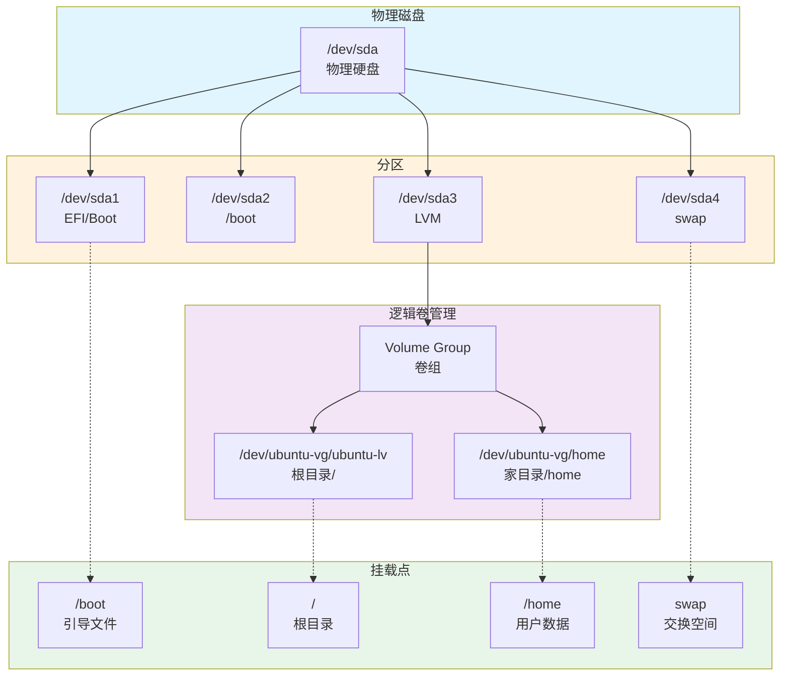

# Linux 常用命令

## Linux 磁盘分区与挂载



### 分区说明

| 分区/挂载点 | 作用 | 大小建议 |
|------------|------|----------|
| **/** (根目录) | 整个文件系统的根，所有文件都在它下面 | 20-50GB |
| **/boot** | 存放内核和启动文件 | 500MB-1GB |
| **/home** | 普通用户的个人数据和配置 | 剩余空间 |
| **/var** | 变量数据（日志、缓存、包管理） | 5-20GB |
| **/tmp** | 临时文件 | 2-5GB |
| **/usr** | 系统程序和库文件 | 10-20GB |
| **/opt** | 可选软件包 | 按需分配 |
| **swap** | 虚拟内存（当 RAM 满时使用） | 2-8GB 或 RAM×2 |
| **EFI/ESP** | UEFI 启动分区 | 100-500MB |

### 分区策略

**桌面系统：**
```
/      30-50GB
/home  剩余空间
swap   4-8GB
```

**服务器系统：**
```
/boot    1GB
/        20GB
/home    剩余空间
/var     20GB
/tmp     5GB
swap     4GB
```

---

## 系统信息查看

```bash
# 查看系统版本
lsb_release -a
cat /etc/os-release

# 查看内核版本
uname -r
uname -a

# 查看系统架构
uname -m
dpkg --print-architecture

# 查看系统运行时间
uptime

# 查看系统负载
top
htop

# 查看内存使用
free -h
cat /proc/meminfo

# 查看磁盘使用
df -h

# 查看目录大小
du -sh <directory>
du -sh /var/*

# 查看磁盘分区
lsblk
fdisk -l

# 查看挂载点
mount
cat /etc/fstab

# 查看 CPU 信息
lscpu
cat /proc/cpuinfo

# 查看硬件信息
sudo lshw
sudo lshw -short

# 查看 PCI 设备
lspci

# 查看 USB 设备
lsusb
```

---

## 文件与目录操作

### 基本操作

```bash
# 列出文件
ls
ls -la          # 显示隐藏文件
ls -lh          # 人类可读格式
ls -lt          # 按修改时间排序
ls -lS          # 按大小排序

# 切换目录
cd <directory>
cd ~            # 回到用户家目录
cd -            # 回到上一个目录
cd ..           # 回到上级目录

# 显示当前目录
pwd

# 创建目录
mkdir <directory>
mkdir -p /path/to/dir       # 递归创建
mkdir -p dir1/dir2/dir3     # 创建多级目录

# 删除目录
rmdir <directory>           # 删除空目录
rm -r <directory>           # 递归删除
rm -rf <directory>          # 强制递归删除（慎用！）

# 复制文件/目录
cp <source> <destination>
cp -r <source-dir> <dest-dir>      # 递归复制
cp -p <file> <dest>                # 保留属性
cp -i <file> <dest>                # 覆盖前提示

# 移动/重命名
mv <source> <destination>
mv <old-name> <new-name>
```

### 文件查看

```bash
# 查看文件内容
cat <file>
less <file>          # 分页查看
more <file>          # 分页查看（简化版）

# 查看文件头部
head <file>          # 前 10 行
head -n 20 <file>    # 前 20 行

# 查看文件尾部
tail <file>          # 后 10 行
tail -n 50 <file>    # 后 50 行
tail -f <file>       # 实时查看

# 查看文件类型
file <filename>

# 统计行数、字数、字节数
wc <file>
wc -l <file>         # 只统计行数
wc -c <file>         # 只统计字节数
```

### 文件查找

```bash
# 查找文件
find <path> -name <filename>
find /etc -name "nginx.conf"           # 按名称查找
find /var -type f -name "*.log"        # 查找日志文件
find . -type d -name "test*"           # 查找目录
find /home -size +100M                 # 查找大于 100M 的文件
find /tmp -mtime +7                    # 查找 7 天前的文件
find . -perm 777                        # 查找 777 权限的文件

# 查找后执行命令
find . -name "*.log" -delete                   # 查找并删除
find . -name "*.sh" -exec chmod +x {} \;      # 查找并添加执行权限
find /var/log -name "*.log" -exec rm {} \;    # 查找并删除日志

# 快速定位文件
locate <filename>
updatedb                       # 更新数据库

# 搜索命令路径
which <command>
whereis <command>
```

---

## 文件权限与所有权

### 权限查看与修改

```bash
# 查看权限
ls -l <file>
# 示例输出：-rwxr-xr-- 1 user group 4096 Jan 1 12:00 file.txt

# 权限说明
# -    rwx      r-x      r--
# │    │        │        │
# │    │        │        └─ 其人用户权限 (r-x)
# │    │        └────────── 组用户权限 (r-x)
# │    └────────────────── 所有者权限 (rwx)
# └─────────────────────── 文件类型 (-=文件, d=目录, l=链接)

# 修改权限
chmod <permissions> <file>
chmod 755 script.sh              # 数字方式
chmod u+x script.sh              # 符号方式：给所有者添加执行权限
chmod g+w file.txt               # 给组添加写权限
chmod o-r file.txt               # 移除其他人的读权限
chmod a+x script.sh              # 给所有人添加执行权限

# 常用权限值
# 777 = rwxrwxrwx (所有人可读写执行)
# 755 = rwxr-xr-x (所有者可读写执行，其他人可读执行)
# 644 = rw-r--r-- (所有者可读写，其他人只读)
# 600 = rw------- (只有所有者可读写)
```

### 所有权修改

```bash
# 修改所有者
chown <user> <file>
chown user file.txt

# 修改所有者和组
chown <user>:<group> <file>
chown user:group file.txt

# 递归修改目录及其内容
chown -R user:group /path/to/dir

# 只修改组
chgrp <group> <file>
chown :group file.txt

# 查看用户所属组
groups
groups <username>
```

---

## 用户与组管理

```bash
# 查看当前用户
whoami
id

# 查看所有用户
cat /etc/passwd
cut -d: -f1 /etc/passwd

# 查看所有组
cat /etc/group
getent group

# 添加用户
sudo useradd <username>
sudo useradd -m -s /bin/bash <username>    # 创建家目录和指定 shell
sudo useradd -G sudo,docker <username>     # 添加到指定组

# 设置密码
sudo passwd <username>

# 删除用户
sudo userdel <username>
sudo userdel -r <username>                # 同时删除家目录

# 修改用户
sudo usermod -aG docker <username>        # 将用户添加到 docker 组
sudo usermod -l <new-name> <old-name>     # 重命名用户
sudo usermod -s /bin/zsh <username>       # 修改默认 shell

# 添加组
sudo groupadd <groupname>

# 删除组
sudo groupdel <groupname>

# 切换用户
su - <username>
su -                                     # 切换到 root
sudo <command>                           # 以 root 权限执行命令
sudo -i                                  # 切换到 root shell

# 查看登录用户
who
w
```

---

## 进程管理

```bash
# 查看进程
ps
ps aux                          # 显示所有进程
ps -ef                          # 全格式显示
ps aux | grep <process>         # 过滤进程

# 实时监控进程
top
htop                           # 更友好的界面

# 查看指定进程信息
ps -p <pid>
ps aux | grep <pid>

# 终止进程
kill <pid>
kill -9 <pid>                  # 强制终止
killall <process-name>
pkill <process-name>

# 后台运行
<command> &                    # 后台运行
nohup <command> &              # 忽略挂起信号，关闭终端后继续运行
nohup python script.py > output.log 2>&1 &

# 查看后台任务
jobs
fg %1                         # 将任务 1 调到前台
bg %1                         # 将任务 1 放到后台

# 查看端口占用
sudo netstat -tulpn | grep <port>
sudo ss -tulpn | grep <port>
sudo lsof -i :<port>

# 查看进程打开的文件
sudo lsof -p <pid>
sudo lsof -u <username>

# 系统资源监控
vmstat                         # 虚拟内存统计
iostat                         # I/O 统计
iotop                          # I/O 监控
```

---

## 软件包管理 (APT)

### 基本操作

```bash
# 更新软件包列表
sudo apt update

# 升级所有已安装的软件包
sudo apt upgrade

# 完全升级（可能删除依赖）
sudo apt full-upgrade

# 安装软件包
sudo apt install <package>
sudo apt install nginx git curl

# 安装指定版本
apt list -a <package>                      # 查看可用版本
sudo apt install <package>=<version>       # 安装指定版本

# 删除软件包
sudo apt remove <package>                  # 保留配置文件
sudo apt purge <package>                   # 删除配置文件
sudo apt autoremove                        # 删除不需要的依赖

# 搜索软件包
apt search <keyword>
apt-cache search <keyword>

# 显示软件包信息
apt show <package>
apt-cache show <package>

# 列出已安装的软件包
apt list --installed
apt list --installed | grep <keyword>

# 列出可升级的软件包
apt list --upgradable

# 清理缓存
sudo apt clean
sudo apt autoclean

# 修复依赖
sudo apt --fix-broken install
sudo dpkg --configure -a
```

### DPKG 操作

```bash
# 安装 .deb 包
sudo dpkg -i <package>.deb

# 列出已安装的包
dpkg -l
dpkg -l | grep <keyword>

# 查看包信息
dpkg -I <package>.deb

# 查看包安装的文件
dpkg -L <package-name>

# 查看文件属于哪个包
dpkg -S <filepath>

# 完全删除包
sudo dpkg -P <package-name>

# 配置未完成的包
sudo dpkg --configure -a
```

### 常用软件安装

```bash
# 基础工具
sudo apt install build-essential git curl wget vim net-tools

# 开发工具
sudo apt install python3 python3-pip nodejs npm

# 数据库
sudo apt install mysql-server postgresql redis-server

# Web 服务器
sudo apt install nginx apache2

# 容器
curl -fsSL https://get.docker.com | sh
sudo apt install docker-compose

# 系统监控
sudo apt install htop iotop nethogs
```

---

## 服务管理 (Systemd)

```bash
# 启动服务
sudo systemctl start <service>

# 停止服务
sudo systemctl stop <service>

# 重启服务
sudo systemctl restart <service>

# 重新加载配置
sudo systemctl reload <service>

# 开机自启
sudo systemctl enable <service>

# 关闭自启
sudo systemctl disable <service>

# 查看服务状态
sudo systemctl status <service>

# 查看是否开机自启
systemctl is-enabled <service>

# 查看所有服务
systemctl list-units --type=service
systemctl list-units --type=service --all

# 查看所有启用的服务
systemctl list-unit-files --state=enabled

# 查看服务日志
sudo journalctl -u <service>
sudo journalctl -u <service> -f          # 实时查看
sudo journalctl -u <service> --since today
sudo journalctl -u <service> -n 100      # 最近 100 行
```

### 常用服务操作示例

```bash
# Nginx
sudo systemctl start nginx
sudo systemctl enable nginx
sudo systemctl status nginx

# MySQL
sudo systemctl start mysql
sudo systemctl enable mysql

# Docker
sudo systemctl start docker
sudo systemctl enable docker

# 防火墙
sudo systemctl start ufw
sudo systemctl enable ufw
```

---

## 网络配置与管理

```bash
# 查看网络接口
ip addr
ifconfig
ip link show

# 查看网络连接
netstat -tuln
ss -tuln

# 启用/禁用网络接口
sudo ip link set <interface> up
sudo ip link set <interface> down
sudo ifconfig <interface> up
sudo ifconfig <interface> down

# 配置 IP 地址
sudo ip addr add <ip>/<cidr> dev <interface>
sudo ip addr del <ip>/<cidr> dev <interface>

# 查看路由表
ip route
route -n

# 添加默认网关
sudo ip route add default via <gateway-ip>

# 查看网络统计
ip -s link
netstat -i

# 测试网络连接
ping <host>
ping -c 4 8.8.8.8

# 测试端口连通性
telnet <host> <port>
nc -zv <host> <port>

# DNS 查询
nslookup <domain>
dig <domain>
host <domain>

# 下载文件
wget <url>
wget -O <filename> <url>
curl -O <url>
curl -L <url> > <filename>

# 查看网络带宽
speedtest-cli
iftop
nethogs
```

### 防火墙 (UFW)

```bash
# 启用防火墙
sudo ufw enable

# 禁用防火墙
sudo ufw disable

# 查看状态
sudo ufw status
sudo ufw status verbose

# 允许端口
sudo ufw allow 22
sudo ufw allow 80/tcp
sudo ufw allow 443/tcp
sudo ufw allow 8000:9000/tcp    # 范围

# 拒绝端口
sudo ufw deny 23

# 允许指定 IP
sudo ufw allow from 192.168.1.100
sudo ufw allow from 192.168.1.0/24 to any port 22

# 删除规则
sudo ufw delete allow 22

# 重置防火墙
sudo ufw reset
```

### SSH 配置

```bash
# 安装 SSH
sudo apt install openssh-server

# 启动 SSH 服务
sudo systemctl start ssh
sudo systemctl enable ssh

# 查看 SSH 状态
sudo systemctl status ssh

# 连接远程服务器
ssh <user>@<host>
ssh -p <port> <user>@<host>
ssh -i <key-file> <user>@<host>

# 生成 SSH 密钥
ssh-keygen -t rsa -b 4096
ssh-keygen -t ed25519

# 复制公钥到服务器
ssh-copy-id <user>@<host>

# 查看 SSH 日志
sudo journalctl -u ssh
```

---

## 磁盘与存储管理

```bash
# 查看磁盘使用
df -h
df -h /home

# 查看目录大小
du -sh <directory>
du -h --max-depth=1 /var

# 查找大文件
find / -type f -size +100M 2>/dev/null
find /var/log -type f -size +50M

# 磁盘分区
sudo fdisk /dev/sda
sudo fdisk -l

# 格式化分区
sudo mkfs.ext4 /dev/sdb1
sudo mkfs.xfs /dev/sdb1
sudo mkfs.ntfs /dev/sdb1

# 挂载
sudo mount /dev/sdb1 /mnt
mount -t ntfs /dev/sdb1 /mnt
mount -t nfs 192.168.1.100:/data /mnt

# 卸载
sudo umount /mnt
sudo umount /dev/sdb1

# 查看挂载点
mount
df -h
cat /etc/fstab

# 修复文件系统
sudo fsck /dev/sdb1

# 查看磁盘 I/O
iostat -x 1
iotop

# RAID 配置
cat /proc/mdstat
mdadm --detail /dev/md0
```

### LVM 逻辑卷管理

```bash
# 创建物理卷
sudo pvcreate /dev/sdb1

# 创建卷组
sudo vgcreate vg01 /dev/sdb1

# 创建逻辑卷
sudo lvcreate -L 10G -n lv01 vg01
sudo lvcreate -l 100%FREE -n lv02 vg01

# 扩展逻辑卷
sudo lvextend -L +5G /dev/vg01/lv01
sudo lvextend -l +100%FREE /dev/vg01/lv01

# 缩减逻辑卷（需先缩减文件系统）
sudo lvreduce -L -5G /dev/vg01/lv01

# 格式化逻辑卷
sudo mkfs.ext4 /dev/vg01/lv01

# 查看卷信息
sudo pvs
sudo vgs
sudo lvs
```

---

## 压缩与解压

```bash
# tar 打包/解包
tar -cvf archive.tar files/              # 打包
tar -xvf archive.tar                    # 解包
tar -czvf archive.tar.gz files/         # 打包并 gzip 压缩
tar -xzvf archive.tar.gz                # 解压 gzip
tar -cjvf archive.tar.bz2 files/        # 打包并 bzip2 压缩
tar -xjvf archive.tar.bz2               # 解压 bzip2

# zip/unzip
zip -r archive.zip files/               # 压缩
unzip archive.zip                       # 解压
unzip archive.zip -d /path/to/dir       # 解压到指定目录

# gzip
gzip file                               # 压缩（删除原文件）
gzip -d file.gz                         # 解压
gunzip file.gz                          # 解压
gzip -k file                            # 压缩（保留原文件）

# 查看压缩包内容
tar -tzvf archive.tar.gz
unzip -l archive.zip
```

---

## 文本处理

```bash
# grep 搜索
grep "pattern" file.txt
grep -r "pattern" /path/to/dir          # 递归搜索
grep -i "pattern" file.txt              # 忽略大小写
grep -n "pattern" file.txt              # 显示行号
grep -v "pattern" file.txt              # 反向匹配
grep -E "pat1|pat2" file.txt            # 正则表达式

# sed 流编辑
sed 's/old/new/' file.txt               # 替换（每行第一个）
sed 's/old/new/g' file.txt              # 替换（所有）
sed -i 's/old/new/g' file.txt           # 直接修改文件
sed '/pattern/d' file.txt               # 删除匹配行
sed '5d' file.txt                       # 删除第 5 行
sed -n '5,10p' file.txt                 # 打印 5-10 行

# awk 文本分析
awk '{print $1}' file.txt               # 打印第一列
awk -F: '{print $1}' /etc/passwd        # 指定分隔符
awk '{sum+=$1} END {print sum}' file.txt # 求和
awk 'NR==5' file.txt                    # 打印第 5 行
awk 'NR>=5 && NR<=10' file.txt          # 打印 5-10 行

# sort 排序
sort file.txt
sort -n file.txt                        # 数字排序
sort -r file.txt                        # 反向排序
sort -u file.txt                        # 去重
sort -k2 file.txt                       # 按第 2 列排序

# uniq 去重
uniq file.txt                           # 去重（需先排序）
uniq -c file.txt                        # 统计重复次数
sort file.txt | uniq -c                 # 排序后去重统计

# wc 统计
wc file.txt                             # 统计行、词、字节
wc -l file.txt                          # 统计行数
wc -w file.txt                          # 统计词数
wc -c file.txt                          # 统计字节数

# diff 比较
diff file1.txt file2.txt
diff -r dir1/ dir2/                     # 递归比较目录

# cut 切割
cut -d: -f1 /etc/passwd                 # 按 : 分隔，取第 1 列
cut -c1-5 file.txt                      # 取每行的 1-5 字符
```

---

## 日志管理

```bash
# 系统日志位置
/var/log/syslog         # 系统日志
/var/log/auth.log       # 认证日志
/var/log/kern.log       # 内核日志
/var/log/dmesg          # 启动日志
/var/log/nginx/         # Nginx 日志
/var/log/apache2/       # Apache 日志

# 查看日志
tail -f /var/log/syslog
tail -n 100 /var/log/auth.log

# journalctl (systemd 日志)
journalctl                              # 查看所有日志
journalctl -n 100                       # 最近 100 行
journalctl -f                           # 实时查看
journalctl --since today                # 今天的日志
journalctl --since "2024-01-01"         # 指定日期
journalctl -u ssh                       # 指定服务
journalctl -p err                       # 只显示错误

# dmesg (内核日志)
dmesg
dmesg | tail
dmesg | grep -i usb

# 日志轮转配置
cat /etc/logrotate.conf
cat /etc/logrotate.d/<service>
```

---

## 定时任务 (Crontab)

```bash
# 编辑定时任务
crontab -e

# 查看定时任务
crontab -l

# 删除定时任务
crontab -r

# 编辑其他用户的定时任务
sudo crontab -u <user> -e

# 时间格式
# ┌───────────── 分钟 (0 - 59)
# │ ┌───────────── 小时 (0 - 23)
# │ │ ┌───────────── 日期 (1 - 31)
# │ │ │ ┌───────────── 月份 (1 - 12)
# │ │ │ │ ┌───────────── 星期 (0 - 7, 0和7都是周日)
# │ │ │ │ │
# * * * * * command

# 示例
0 0 * * * /backup.sh                    # 每天 0 点执行
0 */6 * * * /usr/bin/php /cron.php      # 每 6 小时执行
0 9-17 * * 1-5 /script.sh               # 工作日 9-17 点整点执行
*/15 * * * * command                    # 每 15 分钟执行
@reboot /script.sh                      # 系统重启时执行

# 系统级定时任务
ls /etc/cron.d/                         # 目录中的脚本
cat /etc/crontab                        # 系统级配置
```

---

## 环境变量

```bash
# 查看环境变量
env
printenv
echo $PATH
echo $HOME

# 设置环境变量（临时）
export VAR=value
export PATH=$PATH:/new/path

# 永久设置环境变量
# 添加到 ~/.bashrc 或 ~/.profile
echo 'export VAR=value' >> ~/.bashrc
source ~/.bashrc

# 查看所有变量
set

# 删除变量
unset VAR

# 常用配置文件
~/.bashrc          # 用户 bash 配置（交互式 shell）
~/.profile         # 用户 profile（登录 shell）
~/.bash_profile    # 用户 bash profile
/etc/environment   # 系统环境变量
/etc/profile       # 系统全局 profile
```

---

## Shell 快捷键

```bash
# 光标移动
Ctrl + A       移动到行首
Ctrl + E       移动到行尾
Ctrl + F       前移一个字符
Ctrl + B       后移一个字符
Alt + F        前移一个词
Alt + B        后移一个词

# 编辑
Ctrl + C       中断当前命令
Ctrl + D       退出 shell
Ctrl + L       清屏
Ctrl + U       删除到行首
Ctrl + K       删除到行尾
Ctrl + W       删除前一个词
Ctrl + Y       粘贴已删除的内容
Ctrl + _       撤销

# 历史记录
Ctrl + R       搜索历史命令
Ctrl + P       上一条命令
Ctrl + N       下一条命令
!!             执行上一条命令
!$             上一条命令的最后一个参数
history        查看历史记录
!n             执行历史记录中第 n 条命令

# 任务控制
Ctrl + Z       暂停当前进程，放到后台
jobs           查看后台任务
fg %n          将任务 n 调到前台
bg %n          将任务 n 放到后台
```

---

## 常用组合命令

```bash
# 查找并删除大文件
find /var/log -type f -size +100M -exec rm {} \;

# 查找并压缩日志
find /var/log -name "*.log" -exec gzip {} \;

# 统计目录下文件数量
find . -type f | wc -l

# 查找指定时间范围的文件
find /tmp -mtime -7                    # 7 天内修改的
find /tmp -mtime +30                   # 30 天前修改的
find /tmp -mmin -60                    # 60 分钟内修改的

# 批量重命名
rename 's/.txt/.bak/' *.txt

# 监控文件变化
watch -n 1 'cat /proc/meminfo'
tail -f file.log

# 批量修改权限
find . -type f -exec chmod 644 {} \;
find . -type d -exec chmod 755 {} \;

# 查找并杀死进程
ps aux | grep <process> | awk '{print $2}' | xargs kill
killall <process-name>
pkill <process-name>

# 端口占用检查
sudo lsof -i :80
sudo netstat -tuln | grep 80
sudo ss -tuln | grep 80
```

---

## 系统性能优化

```bash
# 查看 CPU 占用最高的进程
ps aux --sort=-%cpu | head -n 10

# 查看内存占用最高的进程
ps aux --sort=-%mem | head -n 10

# 清理缓存
sync && echo 3 > /proc/sys/vm/drop_caches    # 清理页缓存
sync && echo 2 > /proc/sys/vm/drop_caches    # 清理目录项和 inode
sync && echo 1 > /proc/sys/vm/drop_caches    # 清理页缓存、目录项和 inode

# 查看打开的文件数
lsof | wc -l
ulimit -n

# 修改文件打开数限制
ulimit -n 65535
echo "* soft nofile 65535" >> /etc/security/limits.conf
echo "* hard nofile 65535" >> /etc/security/limits.conf

# 查看系统限制
ulimit -a
```

---

## 常见问题排查

```bash
# 磁盘满
df -h                                   # 查看磁盘使用
du -sh /var/* | sort -h                 # 找大目录
sudo apt clean                          # 清理 apt 缓存
sudo journalctl --vacuum-time=7d        # 清理旧日志

# 内存不足
free -h                                 # 查看内存
vmstat                                  # 查看虚拟内存
sudo sync && echo 3 > /proc/sys/vm/drop_caches   # 清理缓存

# CPU 占用高
top                                     # 查看 CPU 占用
htop                                    # 更友好的界面
ps aux --sort=-%cpu | head -n 10        # 找高 CPU 进程

# 网络问题
ping 8.8.8.8                            # 测试网络连通性
nslookup google.com                     # 测试 DNS
ip addr show                            # 查看网络配置
sudo iptables -L                        # 查看防火墙规则

# 服务无法启动
sudo systemctl status <service>         # 查看服务状态
sudo journalctl -u <service> -n 50      # 查看服务日志
sudo systemctl daemon-reload            # 重载 systemd
```