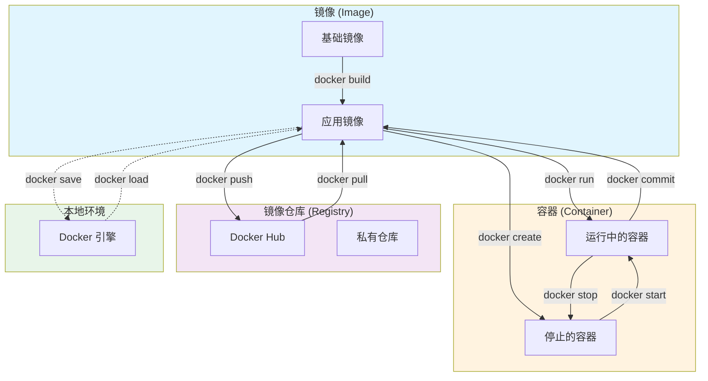

# Docker 常用命令

## Docker 工作区域与命令流向



### 核心概念

| 概念 | 说明 |
|------|------|
| **镜像 (Image)** | 只读模板，包含运行应用所需的一切 |
| **容器 (Container)** | 镜像的运行实例，可启动、停止、删除 |
| **仓库 (Registry)** | 存储和分发镜像的服务（如 Docker Hub） |
| **Dockerfile** | 构建镜像的脚本文件 |

---

## 镜像操作

### 搜索与拉取

```bash
# 搜索镜像
docker search <image-name>

# 拉取最新镜像
docker pull <image-name>

# 拉取指定版本镜像
docker pull <image-name>:<tag>

# 拉取 nginx:alpine 镜像
docker pull nginx:alpine
```

### 查看镜像

```bash
# 列出所有镜像
docker images

# 列出所有镜像（包括中间层）
docker images -a

# 显示镜像摘要信息
docker images --digests

# 查看镜像详细信息
docker inspect <image-id>

# 查看镜像历史
docker history <image-name>
```

### 构建镜像

```bash
# 使用 Dockerfile 构建镜像
docker build -t <image-name>:<tag> <path>

# 使用 Dockerfile 构建镜像（无缓存）
docker build --no-cache -t <image-name>:<tag> <path>

# 使用指定 Dockerfile 构建
docker build -f <dockerfile-path> -t <image-name>:<tag> <path>

# 构建时传入构建参数
docker build --build-arg <key>=<value> -t <image-name>:<tag> <path>

# 示例：构建 myapp:v1.0
docker build -t myapp:v1.0 .
```

### 导出与导入

```bash
# 导出镜像为 tar 文件
docker save -o <file-name>.tar <image-name>

# 导出多个镜像
docker save -o <file-name>.tar <image1> <image2>

# 从 tar 文件导入镜像
docker load -i <file-name>.tar

# 从标准输入导入
docker load < <file-name>.tar
```

### 删除镜像

```bash
# 删除指定镜像
docker rmi <image-id>

# 强制删除镜像（即使有容器在使用）
docker rmi -f <image-id>

# 删除所有未使用的镜像
docker image prune

# 删除所有悬空镜像（dangling）
docker image prune -a

# 删除所有镜像（慎用）
docker rmi -f $(docker images -q)
```

### 镜像标签

```bash
# 为镜像添加新标签
docker tag <source-image> <new-image>:<tag>

# 示例：为镜像打标签
docker tag myapp:v1.0 myapp:latest
docker tag myapp:v1.0 registry.example.com/myapp:v1.0
```

---

## 容器操作

### 创建与启动

```bash
# 创建并启动容器
docker run <image-name>

# 创建并启动容器（后台运行）
docker run -d <image-name>

# 创建并启动容器（指定端口映射）
docker run -d -p <host-port>:<container-port> <image-name>

# 创建并启动容器（指定名称）
docker run --name <container-name> <image-name>

# 创建并启动容器（挂载目录）
docker run -v <host-path>:<container-path> <image-name>

# 创建并启动容器（指定环境变量）
docker run -e <key>=<value> <image-name>

# 完整示例：运行 nginx
docker run -d --name my-nginx -p 8080:80 -v /data:/usr/share/nginx/html nginx:alpine

# 创建容器（不启动）
docker create <image-name>

# 启动已存在的容器
docker start <container-id>

# 停止运行中的容器
docker stop <container-id>

# 强制停止容器
docker kill <container-id>

# 重启容器
docker restart <container-id>

# 暂停容器
docker pause <container-id>

# 恢复暂停的容器
docker unpause <container-id>
```

### 容器管理

```bash
# 列出运行中的容器
docker ps

# 列出所有容器（包括停止的）
docker ps -a

# 查看容器详细信息
docker inspect <container-id>

# 查看容器日志
docker logs <container-id>

# 实时查看容器日志
docker logs -f <container-id>

# 查看最近 100 行日志
docker logs --tail 100 <container-id>

# 查看容器内进程
docker top <container-id>

# 查看容器资源使用
docker stats

# 查看容器资源使用（指定容器）
docker stats <container-id>

# 查看容器端口映射
docker port <container-id>
```

### 容器交互

```bash
# 进入运行中的容器（执行命令）
docker exec <container-id> <command>

# 以交互模式进入容器
docker exec -it <container-id> /bin/bash

# 以交互模式进入容器（alpine 镜像用 sh）
docker exec -it <container-id> /bin/sh

# 在容器中执行命令
docker exec <container-id> ls -la

# 从容器复制文件到主机
docker cp <container-id>:<container-path> <host-path>

# 从主机复制文件到容器
docker cp <host-path> <container-id>:<container-path>
```

### 容器删除

```bash
# 删除已停止的容器
docker rm <container-id>

# 强制删除运行中的容器
docker rm -f <container-id>

# 删除所有已停止的容器
docker container prune

# 删除所有容器（慎用）
docker rm -f $(docker ps -aq)
```

### 容器导出

```bash
# 将容器导出为 tar 文件
docker export <container-id> > <file-name>.tar

# 从 tar 文件导入为镜像
docker import <file-name>.tar <new-image-name>:<tag>
```

---

## 仓库操作

### 登录与登出

```bash
# 登录到 Docker Hub
docker login

# 登录到私有仓库
docker login <registry-url>

# 登录到私有仓库（指定用户名）
docker login -u <username> <registry-url>

# 登出
docker logout

# 登出指定仓库
docker logout <registry-url>
```

### 推送镜像

```bash
# 推送镜像到仓库
docker push <image-name>:<tag>

# 推送到私有仓库
docker push <registry-url>/<image-name>:<tag>

# 示例：推送到 Docker Hub
docker tag myapp:v1.0 username/myapp:v1.0
docker push username/myapp:v1.0

# 示例：推送到私有仓库
docker tag myapp:v1.0 registry.example.com/myapp:v1.0
docker push registry.example.com/myapp:v1.0
```

---

## 网络操作

```bash
# 列出所有网络
docker network ls

# 查看网络详细信息
docker network inspect <network-name>

# 创建网络
docker network create <network-name>

# 创建桥接网络
docker network create --driver bridge <network-name>

# 连接容器到网络
docker network connect <network-name> <container-name>

# 断开容器与网络的连接
docker network disconnect <network-name> <container-name>

# 删除网络
docker network rm <network-name>

# 删除所有未使用的网络
docker network prune
```

### 预定义网络类型

| 类型 | 说明 |
|------|------|
| bridge | 默认网络，容器间可通过 IP 通信 |
| host | 容器使用主机网络栈 |
| none | 容器无网络 |
| overlay | 跨主机网络（Swarm 模式） |

---

## 数据卷操作

```bash
# 列出所有数据卷
docker volume ls

# 查看数据卷详细信息
docker volume inspect <volume-name>

# 创建数据卷
docker volume create <volume-name>

# 删除数据卷
docker volume rm <volume-name>

# 删除所有未使用的数据卷
docker volume prune

# 删除所有数据卷（慎用）
docker volume rm $(docker volume ls -q)
```

### 使用数据卷

```bash
# 创建容器时使用数据卷
docker run -v <volume-name>:<container-path> <image-name>

# 创建容器时挂载主机目录
docker run -v <host-path>:<container-path> <image-name>

# 创建只读数据卷
docker run -v <volume-name>:<container-path>:ro <image-name>

# 示例：挂载数据卷
docker run -d -v my-data:/app/data myapp:v1.0
```

---

## 系统管理

### 信息查看

```bash
# 显示 Docker 系统信息
docker info

# 显示 Docker 版本
docker version

# 显示 Docker 版本（简短格式）
docker --version

# 查看磁盘使用情况
docker system df

# 查看详细信息
docker system df -v
```

### 清理操作

```bash
# 清理所有未使用的对象
docker system prune

# 清理所有未使用的对象（包括未使用的镜像）
docker system prune -a

# 清理所有未使用的对象（包括卷）
docker system prune -a --volumes

# 清理构建缓存
docker builder prune
```

---

## Docker Compose

### 基本命令

```bash
# 启动所有服务
docker-compose up

# 后台启动所有服务
docker-compose up -d

# 停止所有服务
docker-compose down

# 停止并删除卷
docker-compose down -v

# 查看服务状态
docker-compose ps

# 查看服务日志
docker-compose logs

# 查看指定服务日志
docker-compose logs <service-name>

# 实时查看日志
docker-compose logs -f

# 启动指定服务
docker-compose start <service-name>

# 停止指定服务
docker-compose stop <service-name>

# 重启指定服务
docker-compose restart <service-name>

# 构建服务镜像
docker-compose build

# 构建并启动
docker-compose up -d --build

# 进入服务容器
docker-compose exec <service-name> /bin/bash

# 在服务中执行命令
docker-compose run <service-name> <command>

# 查看服务运行的进程
docker-compose top

# 拉取服务镜像
docker-compose pull

# 推送服务镜像
docker-compose push
```

### Docker Compose 示例

```yaml
version: '3.8'

services:
  web:
    image: nginx:alpine
    ports:
      - "8080:80"
    volumes:
      - ./html:/usr/share/nginx/html
    networks:
      - frontend
    depends_on:
      - api

  api:
    build: ./api
    ports:
      - "3000:3000"
    environment:
      - NODE_ENV=production
      - DB_HOST=db
    networks:
      - frontend
      - backend

  db:
    image: postgres:14
    volumes:
      - db-data:/var/lib/postgresql/data
    environment:
      - POSTGRES_PASSWORD=secret
    networks:
      - backend

networks:
  frontend:
  backend:

volumes:
  db-data:
```

---

## 常见使用场景

### Web 应用部署

```bash
# 1. 构建镜像
docker build -t myapp:v1.0 .

# 2. 运行容器
docker run -d \
  --name myapp \
  -p 8080:8080 \
  -v /app/logs:/app/logs \
  -e ENV=production \
  --restart unless-stopped \
  myapp:v1.0

# 3. 查看日志
docker logs -f myapp

# 4. 进入容器
docker exec -it myapp /bin/bash
```

### 数据库服务

```bash
# MySQL
docker run -d \
  --name mysql \
  -p 3306:3306 \
  -e MYSQL_ROOT_PASSWORD=secret \
  -e MYSQL_DATABASE=mydb \
  -v mysql-data:/var/lib/mysql \
  --restart unless-stopped \
  mysql:8.0

# PostgreSQL
docker run -d \
  --name postgres \
  -p 5432:5432 \
  -e POSTGRES_PASSWORD=secret \
  -e POSTGRES_DB=mydb \
  -v postgres-data:/var/lib/postgresql/data \
  --restart unless-stopped \
  postgres:14

# Redis
docker run -d \
  --name redis \
  -p 6379:6379 \
  -v redis-data:/data \
  --restart unless-stopped \
  redis:alpine
```

### 开发环境

```bash
# 运行开发容器（挂载源码）
docker run -it --rm \
  -v $(pwd):/app \
  -w /app \
  node:18-alpine \
  /bin/sh

# 运行一次性命令
docker run --rm \
  -v $(pwd):/app \
  -w /app \
  node:18-alpine \
  npm install
```

---

## Dockerfile 最佳实践

### 基础模板

```dockerfile
# 使用官方镜像作为基础
FROM node:18-alpine

# 设置工作目录
WORKDIR /app

# 复制依赖文件
COPY package*.json ./

# 安装依赖
RUN npm ci --only=production

# 复制源代码
COPY . .

# 暴露端口
EXPOSE 3000

# 设置环境变量
ENV NODE_ENV=production

# 健康检查
HEALTHCHECK --interval=30s --timeout=3s \
  CMD node healthcheck.js || exit 1

# 非root用户运行
RUN addgroup -g 1001 -S nodejs && \
    adduser -S nodejs -u 1001
USER nodejs

# 启动命令
CMD ["node", "index.js"]
```

### 多阶段构建

```dockerfile
# 构建阶段
FROM node:18 AS builder
WORKDIR /app
COPY package*.json ./
RUN npm ci
COPY . .
RUN npm run build

# 运行阶段
FROM node:18-alpine
WORKDIR /app
COPY --from=builder /app/dist ./dist
COPY package*.json ./
RUN npm ci --only=production
EXPOSE 3000
CMD ["node", "dist/index.js"]
```

---

## 容器重启策略

| 策略 | 说明 |
|------|------|
| no | 不自动重启（默认） |
| on-failure | 只有在错误退出时重启 |
| on-failure:5 | 最多重启 5 次 |
| always | 总是重启 |
| unless-stopped | 总是重启，除非手动停止 |

```bash
# 使用重启策略
docker run -d --restart unless-stopped myapp:v1.0

# 更新已有容器的重启策略
docker update --restart unless-stopped <container-id>
```

---

## 常用组合命令

```bash
# 停止所有运行中的容器
docker stop $(docker ps -q)

# 删除所有已停止的容器
docker rm $(docker ps -a -q)

# 删除所有未使用的镜像
docker rmi $(docker images -f "dangling=true" -q)

# 查看所有容器的 IP 地址
docker inspect --format='{{.Name}} - {{range .NetworkSettings.Networks}}{{.IPAddress}}{{end}}' $(docker ps -aq)

# 清理 Docker 系统所有未使用的资源
docker system prune -a --volumes -f
```

---

## 故障排查

```bash
# 查看容器日志
docker logs <container-id>

# 查看容器详细信息
docker inspect <container-id>

# 查看容器内进程
docker top <container-id>

# 查看容器资源使用
docker stats <container-id>

# 查看容器端口映射
docker port <container-id>

# 检查容器健康状态
docker inspect --format='{{.State.Health.Status}}' <container-id>

# 查看容器挂载点
docker inspect --format='{{json .Mounts}}' <container-id> | jq
```