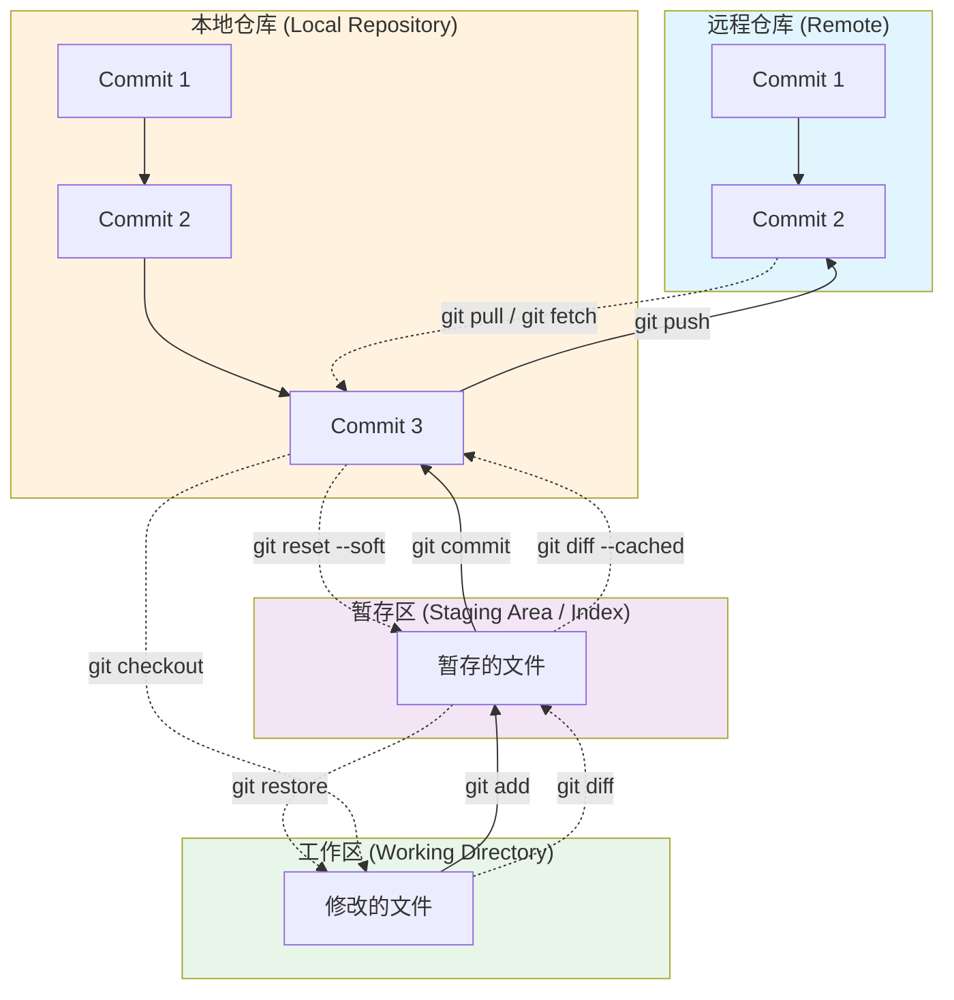
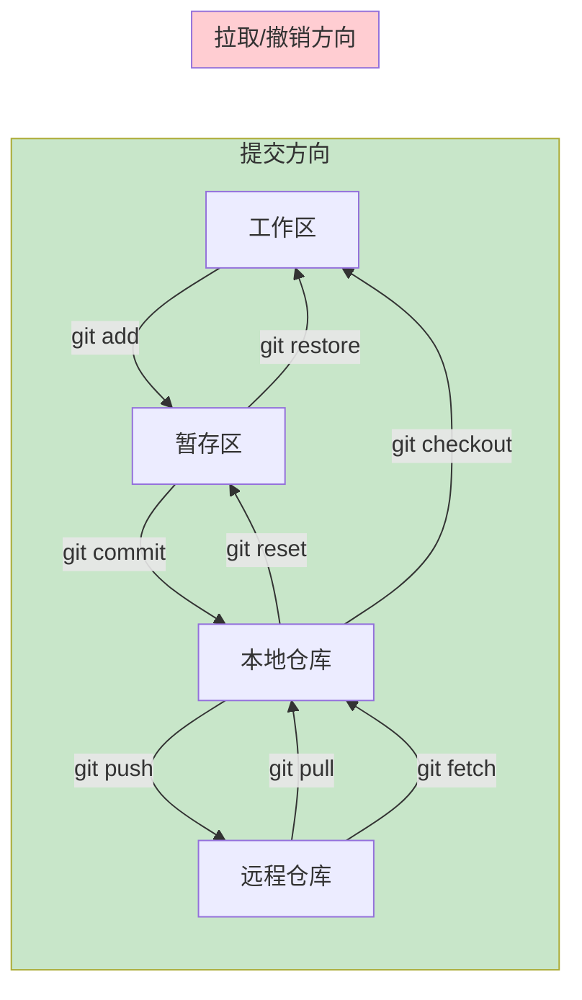

# Git 常用命令

## Git 工作区域与命令流向



### 区域说明

| 区域 | 说明 |
|------|------|
| **工作区** | 你实际操作的文件目录 |
| **暂存区** | 存放待提交的文件（索引） |
| **本地仓库** | 本地提交历史（.git 目录） |
| **远程仓库** | 远程服务器上的仓库 |

### 命令流向图示



## 基础命令

### 配置相关

```bash
# 设置用户名
git config --global user.name "Your Name"

# 设置邮箱
git config --global user.email "your.email@example.com"

# 查看配置
git config --list
```

### 仓库操作

```bash
# 初始化仓库
git init

# 克隆远程仓库
git clone <repository-url>

# 查看当前状态
git status

# 查看远程仓库
git remote -v

# 添加远程仓库
git remote add origin <repository-url>
```

## 暂存与提交

```bash
# 添加指定文件到暂存区
git add <file-name>

# 添加所有文件到暂存区
git add .

# 添加所有修改的文件（包括删除）
git add -A

# 提交暂存区内容
git commit -m "commit message"

# 跳过暂存区，直接提交所有已跟踪文件的修改
git commit -am "commit message"

# 修改最后一次提交
git commit --amend
```

## 分支管理

```bash
# 查看所有分支
git branch

# 查看所有分支（包括远程）
git branch -a

# 创建新分支
git branch <branch-name>

# 切换分支
git checkout <branch-name>

# 创建并切换到新分支
git checkout -b <branch-name>

# 删除本地分支
git branch -d <branch-name>

# 强制删除分支
git branch -D <branch-name>

# 重命名分支
git branch -m <old-name> <new-name>

# 合并分支
git merge <branch-name>

# 变基操作
git rebase <branch-name>
```

## 远程操作

```bash
# 拉取远程代码并合并
git pull

# 拉取远程代码但不合并
git fetch

# 推送到远程仓库
git push

# 推送指定分支
git push origin <branch-name>

# 推送所有分支
git push --all

# 推送标签
git push --tags

# 设置上游分支
git push -u origin <branch-name>

# 删除远程分支
git push origin --delete <branch-name>
```

## 查看历史

```bash
# 查看提交历史
git log

# 查看简洁的提交历史
git log --oneline

# 查看图形化历史
git log --graph --oneline --all

# 查看某个文件的修改历史
git log -p <file-name>

# 查看某次提交的详细信息
git show <commit-id>

# 查看所有操作记录
git reflog
```

## 撤销与回退

```bash
# 撤销工作区的修改
git restore <file-name>

# 撤销暂存区的修改
git restore --staged <file-name>

# 回退到指定提交（保留工作区修改）
git reset --soft <commit-id>

# 回退到指定提交（保留工作区和暂存区修改）
git reset --mixed <commit-id>

# 回退到指定提交（删除所有修改）
git reset --hard <commit-id>

# 回退到上一个提交
git reset HEAD~1

# 撤销某次提交（创建新提交）
git revert <commit-id>
```

## 标签管理

```bash
# 查看所有标签
git tag

# 创建轻量标签
git tag <tag-name>

# 创建附注标签
git tag -a <tag-name> -m "tag message"

# 删除本地标签
git tag -d <tag-name>

# 推送标签到远程
git push origin <tag-name>

# 推送所有标签到远程
git push origin --tags
```

## 差异比较

```bash
# 查看工作区与暂存区的差异
git diff

# 查看暂存区与最后一次提交的差异
git diff --cached

# 查看工作区与最后一次提交的差异
git diff HEAD

# 比较两个分支的差异
git diff <branch1> <branch2>

# 比较两个提交的差异
git diff <commit-id1> <commit-id2>
```

## 储藏功能

```bash
# 储藏当前工作
git stash

# 储藏并添加说明
git stash save "message"

# 查看储藏列表
git stash list

# 应用最近的储藏
git stash pop

# 应用指定储藏
git stash apply stash@{n}

# 删除指定储藏
git stash drop stash@{n}

# 清空所有储藏
git stash clear
```

## 其他实用命令

```bash
# 查看文件每一行的修改记录
git blame <file-name>

# 清理未跟踪的文件
git clean -f

# 清理未跟踪的文件和目录
git clean -fd

# 查看某次提交修改了哪些文件
git show --name-only <commit-id>

# 查看 HEAD 指向
git log --oneline -1

# 查看分支关系图
git log --graph --decorate --oneline

# 搜索提交历史
git log --grep="keyword"

# 搜索代码内容
git grep "keyword"
```

## 常见工作流程

### 功能开发流程

```bash
# 1. 创建功能分支
git checkout -b feature/new-feature

# 2. 开发并提交
git add .
git commit -m "Add new feature"

# 3. 推送到远程
git push -u origin feature/new-feature

# 4. 合并到主分支
git checkout main
git merge feature/new-feature
git push origin main
```

### 修复问题流程

```bash
# 1. 创建修复分支
git checkout -b fix/bug-fix

# 2. 修复并提交
git add .
git commit -m "Fix bug"

# 3. 推送并合并
git push -u origin fix/bug-fix
```
